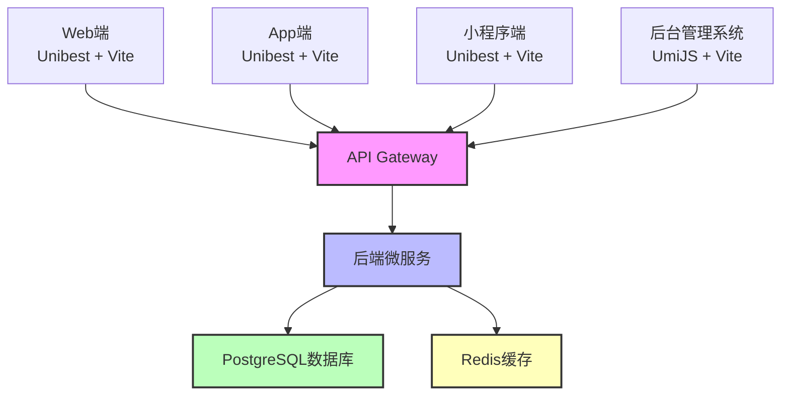
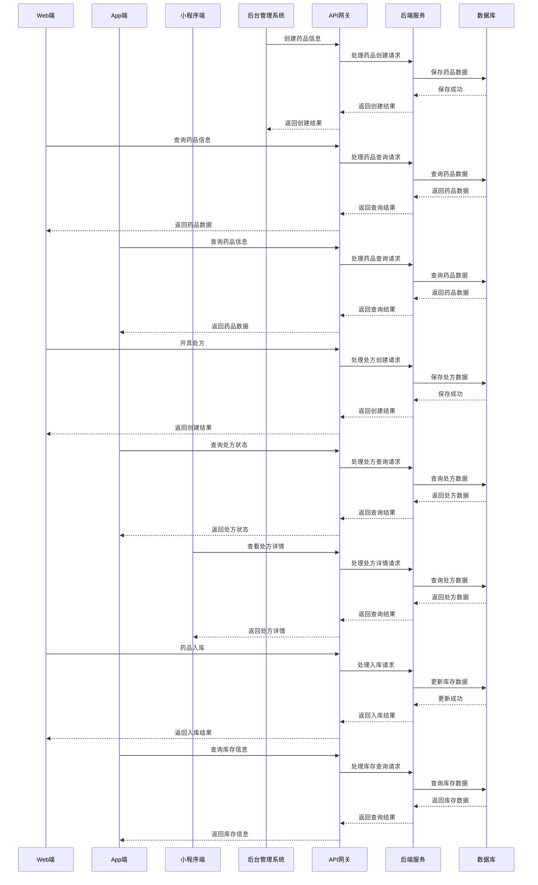

# 医院药品管理系统 - 各端详细需求文档

## 1. 文档概述

### 1.1 文档目的
本需求文档详细描述医院药品管理系统各端（Web端、App端、小程序端、后台管理系统）的功能需求、界面设计要求、交互要求、与后端的接口需求等内容，确保各端之间功能协同、数据一致，为系统开发提供详细的前端需求依据。

### 1.2 端类型说明

| 端类型 | 技术栈 | 创建命令 | 目标用户 | 主要功能 |
| ---- | ---- | ---- | ---- | ---- |
| Web端 | Unibest + Vite + TypeScript | pnpm create unibest | 医生、药房工作人员 | 药品查询、处方开具、库存管理等日常业务 |
| App端 | Unibest + Vite + TypeScript | pnpm create unibest | 医生、药房工作人员 | 移动场景下的药品查询、处方开具等业务 |
| 小程序端 | Unibest + Vite + TypeScript | pnpm create unibest | 医生、药房工作人员 | 轻量级的药品查询、处方查看等业务 |
| 后台管理系统 | UmiJS + Vite + TypeScript | pnpm dlx create-umi@latest | 系统管理员 | 系统配置、权限管理、数据维护等管理功能 |

### 1.3 各端关系图



## 2. Web端需求

### 2.1 功能需求

#### 2.1.1 登录与认证
| 功能点 | 详细需求 | 优先级 |
| ---- | ---- | ---- |
| 用户登录 | 支持用户名+密码+验证码登录，登录失败次数限制（默认5次），超过限制账号锁定30分钟 | 高 |
| 忘记密码 | 支持通过邮箱或手机号找回密码，重置密码需验证身份 | 中 |
| 登录状态保持 | 支持记住登录状态（默认7天），自动登录功能 | 中 |
| 安全退出 | 支持用户手动退出登录，清除本地缓存 | 高 |

#### 2.1.2 药品管理
| 功能点 | 详细需求 | 优先级 |
| ---- | ---- | ---- |
| 药品查询 | 支持按药品名称、编码、生产厂家等条件模糊查询，支持分类筛选，查询结果分页显示 | 高 |
| 药品详情查看 | 支持查看药品详细信息，包括基本信息、规格、效期、价格、处方规则等 | 高 |
| 药品收藏 | 支持医生收藏常用药品，方便快速选择 | 中 |
| 药品批量导入 | 支持Excel格式批量导入药品信息，导入前需校验数据合法性 | 中 |

#### 2.1.3 处方管理
| 功能点 | 详细需求 | 优先级 |
| ---- | ---- | ---- |
| 处方开具 | 支持选择病人、录入诊断结果、选择药品、设置剂量和用法，自动计算处方金额 | 高 |
| 处方规则校验 | 处方开具时自动校验库存、剂量、禁忌、相互作用、过敏史等，校验不通过时提示具体原因 | 高 |
| 处方提交审核 | 支持将处方提交药房审核，显示审核状态和审核意见 | 高 |
| 处方历史查询 | 支持按病人、时间、状态等条件查询历史处方，支持处方详情查看和打印 | 高 |
| 处方模板管理 | 支持医生创建和管理常用处方模板，方便快速开具处方 | 中 |

#### 2.1.4 病人管理
| 功能点 | 详细需求 | 优先级 |
| ---- | ---- | ---- |
| 病人信息查询 | 支持按姓名、身份证号、病历号、联系方式等条件模糊查询病人信息 | 高 |
| 病人详情查看 | 支持查看病人详细信息，包括基本信息、就诊记录、处方历史、过敏史等 | 高 |
| 病人信息编辑 | 支持医生编辑病人基本信息和过敏史，需记录修改日志 | 中 |
| 病人信息导入 | 支持批量导入病人信息，格式兼容Excel | 中 |

#### 2.1.5 库存管理
| 功能点 | 详细需求 | 优先级 |
| ---- | ---- | ---- |
| 库存查询 | 支持按药品名称、规格、批次、效期等条件查询库存，支持按药房筛选 | 高 |
| 库存详情查看 | 支持查看药品库存详情，包括库存数量、批次、效期、库存位置、库存变动记录 | 高 |
| 效期预警查看 | 支持查看近效期药品列表，按效期远近排序 | 高 |
| 库存阈值预警 | 支持查看库存低于阈值的药品列表，支持按药房筛选 | 中 |

#### 2.1.6 药房管理
| 功能点 | 详细需求 | 优先级 |
| ---- | ---- | ---- |
| 处方审核 | 支持药房工作人员查看待审核处方，进行审核通过或驳回操作，需填写审核意见 | 高 |
| 药品入库 | 支持药房工作人员进行药品入库操作，录入药品信息、数量、批次、效期等 | 高 |
| 药品出库 | 支持药房工作人员进行药品出库操作，关联处方单号或手动录入出库信息 | 高 |
| 出入库记录查询 | 支持查询药品出入库记录，按时间、药品、操作人员等条件筛选 | 中 |

### 2.2 界面设计要求

#### 2.2.1 整体风格
- 界面设计符合医疗行业操作习惯，简洁明了，减少医生操作步骤
- 主色调采用蓝色系（代表专业、信任），辅助色采用绿色（代表健康）和红色（代表警告）
- 字体清晰易读，按钮大小适中，便于点击
- 支持暗黑模式，减少长时间使用对眼睛的伤害

#### 2.2.2 布局设计
- 采用左侧导航栏+顶部工具栏+主内容区的经典布局
- 左侧导航栏支持折叠和展开，可自定义常用功能快捷入口
- 主内容区支持多标签页，方便用户在不同功能间切换
- 响应式设计，适配不同屏幕尺寸（1024px以上）

#### 2.2.3 组件设计
- 按钮：主要操作按钮使用实心样式，次要操作使用描边样式
- 表单：表单字段布局合理，必填项标记清晰，输入校验实时反馈
- 表格：支持排序、筛选、分页，表头固定，行高适中
- 弹窗：弹窗居中显示，标题清晰，操作按钮布局合理
- 加载状态：所有异步操作需显示加载状态，避免用户等待焦虑

### 2.3 交互要求

1. **响应速度**：页面加载时间≤2秒，操作响应时间≤1秒
2. **操作反馈**：所有用户操作需提供明确的反馈（成功/失败/警告）
3. **键盘快捷键**：支持常用功能的键盘快捷键，如处方开具、保存等
4. **拖拽操作**：支持药品从收藏夹拖拽到处方中，支持处方药品排序
5. **批量操作**：支持批量选择和操作，如批量审核处方、批量导入数据
6. **自动保存**：处方开具过程中自动保存草稿，避免意外丢失

### 2.4 与后端接口需求

| 接口路径 | 方法 | 功能描述 | 调用时机 |
| ---- | ---- | ---- | ---- |
| /api/v1/auth/login | POST | 用户登录 | 用户点击登录按钮时 |
| /api/v1/drugs | GET | 查询药品列表 | 用户进入药品查询页面或输入查询条件时 |
| /api/v1/drugs/:id | GET | 查询药品详情 | 用户点击药品列表项查看详情时 |
| /api/v1/prescriptions | POST | 开具处方 | 用户点击提交处方按钮时 |
| /api/v1/prescriptions | GET | 查询处方列表 | 用户进入处方历史页面或输入查询条件时 |
| /api/v1/patients | GET | 查询病人列表 | 用户进入病人查询页面或输入查询条件时 |
| /api/v1/inventory | GET | 查询库存列表 | 用户进入库存查询页面或输入查询条件时 |
| /api/v1/inventory | POST | 药品入库 | 药房工作人员点击确认入库按钮时 |
| /api/v1/inventory/outbound | POST | 药品出库 | 药房工作人员点击确认出库按钮时 |

## 3. App端需求

### 3.1 功能需求

#### 3.1.1 登录与认证
| 功能点 | 详细需求 | 优先级 |
| ---- | ---- | ---- |
| 用户登录 | 支持用户名+密码登录，支持指纹/面容识别登录（如果设备支持） | 高 |
| 忘记密码 | 支持通过手机短信找回密码，验证码有效期5分钟 | 中 |
| 登录状态保持 | 登录状态默认保持30天，支持手动退出 | 高 |
| 离线模式 | 支持部分功能离线使用，如查看已缓存的药品信息、处方历史 | 中 |

#### 3.1.2 药品管理
| 功能点 | 详细需求 | 优先级 |
| ---- | ---- | ---- |
| 药品查询 | 支持按药品名称、编码快速搜索，支持语音搜索 | 高 |
| 药品详情查看 | 支持查看药品详细信息，支持图片放大查看 | 高 |
| 药品收藏 | 支持收藏常用药品，支持按科室分类查看收藏药品 | 中 |
| 最近浏览 | 记录最近浏览的药品，方便快速访问 | 中 |

#### 3.1.3 处方管理
| 功能点 | 详细需求 | 优先级 |
| ---- | ---- | ---- |
| 处方开具 | 支持选择病人、录入诊断结果、选择药品、设置剂量和用法，界面适配移动端操作 | 高 |
| 处方规则校验 | 同Web端，自动校验库存、剂量、禁忌、相互作用、过敏史等 | 高 |
| 处方提交审核 | 支持将处方提交药房审核，实时推送审核结果通知 | 高 |
| 处方历史查询 | 支持按时间、状态查询历史处方，支持处方详情查看和分享 | 高 |
| 处方模板管理 | 支持创建和管理常用处方模板，支持模板导入导出 | 中 |

#### 3.1.4 病人管理
| 功能点 | 详细需求 | 优先级 |
| ---- | ---- | ---- |
| 病人信息查询 | 支持按姓名、病历号、手机号快速查询病人信息 | 高 |
| 病人详情查看 | 支持查看病人基本信息、处方历史、过敏史，支持下拉刷新 | 高 |
| 病人信息编辑 | 支持编辑病人基本信息和过敏史，操作界面适配移动端 | 中 |
| 病人二维码 | 支持生成病人二维码，方便药房工作人员快速识别 | 中 |

#### 3.1.5 库存管理
| 功能点 | 详细需求 | 优先级 |
| ---- | ---- | ---- |
| 库存查询 | 支持按药品名称、规格快速查询库存，显示库存数量和效期 | 高 |
| 效期预警查看 | 支持查看近效期药品列表，支持按药房筛选 | 中 |
| 库存盘点 | 支持移动端库存盘点，扫描药品条形码/二维码快速录入 | 中 |

#### 3.1.6 消息通知
| 功能点 | 详细需求 | 优先级 |
| ---- | ---- | ---- |
| 处方审核通知 | 处方审核通过或驳回时，推送通知给医生 | 高 |
| 库存预警通知 | 药品库存低于阈值或效期临近时，推送通知给药房工作人员 | 中 |
| 系统公告 | 推送系统公告和重要通知 | 中 |
| 通知设置 | 支持用户自定义通知类型和接收方式 | 中 |

### 3.2 界面设计要求

#### 3.2.1 整体风格
- 移动端设计风格，简洁、高效，减少操作步骤
- 沿用Web端的主色调（蓝色系），保持品牌一致性
- 字体大小适中（16px以上），便于移动端阅读
- 按钮大小适中（44px以上），便于手指点击

#### 3.2.2 布局设计
- 采用底部导航栏+顶部标题栏+主内容区的布局
- 底部导航栏包含常用功能入口（如首页、药品查询、处方管理、我的）
- 支持手势操作（如左滑返回、下拉刷新）
- 适配不同屏幕尺寸（375px-430px宽度）

#### 3.2.3 组件设计
- 输入框：支持自动聚焦，输入校验实时反馈
- 列表：支持下拉刷新和上拉加载更多
- 弹窗：底部弹窗优先，避免遮挡太多内容
- 扫码组件：支持扫描药品条形码/二维码
- 语音输入：支持处方开具时的语音输入

### 3.3 交互要求

1. **响应速度**：页面加载时间≤1.5秒，操作响应时间≤0.8秒
2. **触摸反馈**：所有可点击元素点击时应有明显的视觉反馈
3. **手势支持**：支持常见手势操作，如点击、长按、滑动、缩放
4. **离线支持**：部分功能支持离线使用，网络恢复后自动同步数据
5. **数据同步**：支持自动同步和手动同步数据
6. **电量优化**：减少后台运行时间，优化电量消耗

### 3.4 与后端接口需求

| 接口路径 | 方法 | 功能描述 | 调用时机 |
| ---- | ---- | ---- | ---- |
| /api/v1/auth/login | POST | 用户登录 | 用户点击登录按钮时 |
| /api/v1/auth/fingerprint/login | POST | 指纹登录 | 用户使用指纹登录时 |
| /api/v1/drugs | GET | 查询药品列表 | 用户进入药品查询页面或输入搜索关键词时 |
| /api/v1/drugs/search/voice | POST | 语音搜索药品 | 用户使用语音搜索时 |
| /api/v1/prescriptions | POST | 开具处方 | 用户点击提交处方按钮时 |
| /api/v1/prescriptions/:id | GET | 查询处方详情 | 用户点击处方列表项查看详情时 |
| /api/v1/patients | GET | 查询病人列表 | 用户进入病人查询页面或输入搜索关键词时 |
| /api/v1/inventory | GET | 查询库存列表 | 用户进入库存查询页面时 |
| /api/v1/notifications | GET | 获取通知列表 | 用户进入消息中心时 |
| /api/v1/notifications/:id/read | PUT | 标记通知为已读 | 用户点击通知或进入消息中心时 |

## 4. 小程序端需求

### 4.1 功能需求

#### 4.1.1 登录与认证
| 功能点 | 详细需求 | 优先级 |
| ---- | ---- | ---- |
| 微信授权登录 | 支持微信授权快速登录，自动获取用户微信信息 | 高 |
| 绑定医院账号 | 首次登录需绑定医院账号，支持账号密码绑定 | 高 |
| 登录状态保持 | 登录状态默认保持7天，支持手动退出 | 高 |

#### 4.1.2 药品管理
| 功能点 | 详细需求 | 优先级 |
| ---- | ---- | ---- |
| 药品查询 | 支持按药品名称、编码快速搜索，结果分页显示 | 高 |
| 药品详情查看 | 支持查看药品基本信息、规格、价格、效期等 | 高 |
| 药品收藏 | 支持收藏常用药品，最多收藏50种药品 | 中 |

#### 4.1.3 处方管理
| 功能点 | 详细需求 | 优先级 |
| ---- | ---- | ---- |
| 处方查看 | 支持查看本人开具的处方列表和详情 | 高 |
| 处方状态查询 | 实时显示处方状态（待审核/审核通过/审核驳回/已出库） | 高 |
| 处方分享 | 支持将处方分享给病人（生成处方二维码） | 中 |

#### 4.1.4 病人管理
| 功能点 | 详细需求 | 优先级 |
| ---- | ---- | ---- |
| 病人信息查询 | 支持按姓名、病历号查询病人基本信息 | 高 |
| 病人处方历史 | 支持查看病人的处方历史记录 | 中 |

#### 4.1.5 库存管理
| 功能点 | 详细需求 | 优先级 |
| ---- | ---- | ---- |
| 库存快速查询 | 支持按药品名称查询库存数量和效期 | 中 |
| 效期预警提醒 | 支持查看近效期药品列表 | 低 |

### 4.2 界面设计要求

#### 4.2.1 整体风格
- 微信小程序设计风格，简洁、轻量化
- 沿用系统主色调（蓝色系），保持品牌一致性
- 符合微信小程序设计规范

#### 4.2.2 布局设计
- 采用顶部导航栏+主内容区的布局
- 支持底部导航栏（最多5个Tab）
- 适配微信小程序的屏幕尺寸

#### 4.2.3 组件设计
- 使用微信小程序原生组件优先，保证性能
- 列表项简洁明了，重点信息突出
- 弹窗使用微信小程序原生弹窗
- 加载状态使用微信小程序原生加载组件

### 4.3 交互要求

1. **响应速度**：页面加载时间≤1秒，操作响应时间≤0.5秒
2. **轻量级操作**：减少输入操作，优先选择和点击操作
3. **符合微信习惯**：交互方式符合微信用户的使用习惯
4. **小程序特性**：充分利用小程序的特性（如分享、扫码）

### 4.4 与后端接口需求

| 接口路径 | 方法 | 功能描述 | 调用时机 |
| ---- | ---- | ---- | ---- |
| /api/v1/auth/wechat/login | POST | 微信授权登录 | 用户首次登录或授权时 |
| /api/v1/auth/bind | POST | 绑定医院账号 | 用户首次登录需绑定账号时 |
| /api/v1/drugs | GET | 查询药品列表 | 用户输入搜索关键词时 |
| /api/v1/prescriptions | GET | 查询处方列表 | 用户进入处方列表页面时 |
| /api/v1/prescriptions/:id | GET | 查询处方详情 | 用户点击处方列表项时 |
| /api/v1/patients | GET | 查询病人列表 | 用户输入病人信息时 |
| /api/v1/inventory | GET | 查询库存列表 | 用户进入库存查询页面时 |

## 5. 后台管理系统需求

### 5.1 功能需求

#### 5.1.1 登录与认证
| 功能点 | 详细需求 | 优先级 |
| ---- | ---- | ---- |
| 管理员登录 | 支持用户名+密码+验证码登录，登录失败次数限制 | 高 |
| 忘记密码 | 支持通过邮箱找回密码 | 中 |
| 登录日志 | 记录所有管理员的登录日志，包括登录时间、IP地址、登录状态 | 高 |

#### 5.1.2 系统配置
| 功能点 | 详细需求 | 优先级 |
| ---- | ---- | ---- |
| 参数配置 | 支持配置系统参数，如处方有效期、登录失败次数限制、JWT有效期等 | 高 |
| 编码规则配置 | 支持配置药品编码、处方单号、病历号等的生成规则 | 中 |
| 邮件服务器配置 | 支持配置邮件服务器，用于发送通知邮件 | 中 |
| 短信服务器配置 | 支持配置短信服务器，用于发送验证码和通知短信 | 中 |

#### 5.1.3 权限管理
| 功能点 | 详细需求 | 优先级 |
| ---- | ---- | ---- |
| 角色管理 | 支持创建、编辑、删除角色，设置角色名称和描述 | 高 |
| 权限分配 | 支持为角色分配权限，可按模块、功能、数据进行权限分配 | 高 |
| 用户管理 | 支持创建、编辑、删除用户，分配角色和部门 | 高 |
| 权限变更记录 | 记录所有权限变更操作，包括变更时间、操作人员、变更内容 | 中 |

#### 5.1.4 医院管理
| 功能点 | 详细需求 | 优先级 |
| ---- | ---- | ---- |
| 医院信息管理 | 支持创建、编辑、删除医院信息，配置医院基本参数 | 高 |
| 科室管理 | 支持创建、编辑、删除科室信息，设置科室类型和负责人 | 高 |
| 药房管理 | 支持创建、编辑、删除药房信息，配置药房基本参数 | 高 |

#### 5.1.5 药品管理
| 功能点 | 详细需求 | 优先级 |
| ---- | ---- | ---- |
| 药品信息管理 | 支持创建、编辑、删除药品信息，批量导入导出药品数据 | 高 |
| 药品分类管理 | 支持创建、编辑、删除药品分类，设置分类层级 | 高 |
| 药品处方规则管理 | 支持创建、编辑、删除药品处方规则，配置剂量限制、禁忌、相互作用等 | 高 |

#### 5.1.6 数据统计与报表
| 功能点 | 详细需求 | 优先级 |
| ---- | ---- | ---- |
| 处方统计 | 支持按时间、医院、科室、医生统计处方数量和金额 | 高 |
| 药品使用统计 | 支持按时间、医院、科室统计药品使用情况，生成Top10常用药品报表 | 高 |
| 库存统计 | 支持统计库存总量、库存周转率、积压药品等 | 中 |
| 报表导出 | 支持将统计数据导出为Excel或PDF格式 | 高 |

#### 5.1.7 操作日志管理
| 功能点 | 详细需求 | 优先级 |
| ---- | ---- | ---- |
| 日志查询 | 支持按用户、操作类型、模块、时间等条件查询操作日志 | 高 |
| 日志详情查看 | 支持查看日志详细信息，包括操作内容、旧数据、新数据、IP地址等 | 高 |
| 日志导出 | 支持将操作日志导出为Excel格式 | 中 |
| 日志清理 | 支持按时间范围清理操作日志 | 中 |

#### 5.1.8 字典管理
| 功能点 | 详细需求 | 优先级 |
| ---- | ---- | ---- |
| 字典类型管理 | 支持创建、编辑、删除字典类型，包括字典类型编码、名称、描述、状态等 | 高 |
| 字典类型状态管理 | 支持启用/禁用字典类型，禁用后的字典类型不可用于业务模块 | 高 |
| 字典项管理 | 支持创建、编辑、删除字典项，包括字典项编码、名称、值、排序、状态等 | 高 |
| 字典项排序 | 支持自定义字典项排序，影响业务模块中的显示顺序 | 中 |
| 字典项状态管理 | 支持启用/禁用字典项，禁用后的字典项不可用于业务模块 | 高 |
| 字典数据导出 | 支持将字典数据导出为Excel格式 | 中 |

#### 5.1.9 数据备份与恢复
| 功能点 | 详细需求 | 优先级 |
| ---- | ---- | ---- |
| 自动备份配置 | 支持配置自动备份策略，如备份时间、备份频率、备份保留天数 | 高 |
| 手动备份 | 支持手动触发数据库备份 | 高 |
| 备份历史查询 | 支持查询备份历史记录，查看备份状态和大小 | 中 |
| 数据恢复 | 支持从备份文件恢复数据，恢复前需确认 | 高 |

### 5.2 界面设计要求

#### 5.2.1 整体风格
- 后台管理系统设计风格，专业、高效
- 主色调采用蓝色系，辅助色采用灰色系
- 布局清晰，信息层级分明
- 支持暗黑模式

#### 5.2.2 布局设计
- 采用左侧导航栏+顶部工具栏+主内容区+右侧统计面板的布局
- 左侧导航栏支持多级菜单，可折叠和展开
- 主内容区支持多标签页，方便在不同功能间切换
- 右侧统计面板显示关键指标（如处方数量、药品数量、在线用户数等）

#### 5.2.3 组件设计
- 表格：支持排序、筛选、分页、批量操作
- 表单：支持表单验证、字段联动、动态表单
- 图表：支持折线图、柱状图、饼图、雷达图等多种图表类型
- 弹窗：支持模态弹窗、抽屉式弹窗
- 搜索框：支持高级搜索，可配置搜索条件

### 5.3 交互要求

1. **响应速度**：页面加载时间≤2秒，操作响应时间≤1秒
2. **批量操作**：支持批量创建、编辑、删除数据
3. **实时统计**：关键指标实时更新，支持刷新
4. **操作确认**：危险操作（如删除、恢复数据）需二次确认
5. **导出进度**：导出大量数据时显示进度条
6. **快捷键支持**：支持常用功能的键盘快捷键

### 5.4 与后端接口需求

| 接口路径 | 方法 | 功能描述 | 调用时机 |
| ---- | ---- | ---- | ---- |
| /api/v1/auth/login | POST | 管理员登录 | 管理员点击登录按钮时 |
| /api/v1/system/parameters | GET | 查询系统参数 | 管理员进入参数配置页面时 |
| /api/v1/system/parameters/:id | PUT | 更新系统参数 | 管理员保存参数配置时 |
| /api/v1/roles | GET | 查询角色列表 | 管理员进入角色管理页面时 |
| /api/v1/roles | POST | 创建角色 | 管理员点击创建角色按钮时 |
| /api/v1/roles/:id | PUT | 更新角色 | 管理员保存角色编辑时 |
| /api/v1/roles/:id | DELETE | 删除角色 | 管理员点击删除角色按钮时 |
| /api/v1/permissions | GET | 查询权限列表 | 管理员进入权限管理页面时 |
| /api/v1/users | GET | 查询用户列表 | 管理员进入用户管理页面时 |
| /api/v1/reports/prescriptions | GET | 获取处方统计数据 | 管理员进入处方统计页面时 |
| /api/v1/reports/drugs | GET | 获取药品使用统计数据 | 管理员进入药品使用统计页面时 |
| /api/v1/operation-logs | GET | 查询操作日志 | 管理员进入操作日志页面时 |
| /api/v1/backup | POST | 手动备份数据 | 管理员点击手动备份按钮时 |
| /api/v1/dict-types | GET | 查询字典类型列表 | 管理员进入字典类型管理页面时 |
| /api/v1/dict-types | POST | 创建字典类型 | 管理员点击创建字典类型按钮时 |
| /api/v1/dict-types/:id | PUT | 更新字典类型 | 管理员保存字典类型编辑时 |
| /api/v1/dict-types/:id | DELETE | 删除字典类型 | 管理员点击删除字典类型按钮时 |
| /api/v1/dict-items | GET | 查询字典项列表 | 管理员进入字典项管理页面时 |
| /api/v1/dict-items | POST | 创建字典项 | 管理员点击创建字典项按钮时 |
| /api/v1/dict-items/:id | PUT | 更新字典项 | 管理员保存字典项编辑时 |
| /api/v1/dict-items/:id | DELETE | 删除字典项 | 管理员点击删除字典项按钮时 |
| /api/v1/dict-items/by-type/:typeCode | GET | 按字典类型查询字典项 | 业务模块需要字典数据时 |

## 6. 各端数据流转

### 6.1 核心数据流转图



### 6.2 数据一致性保障

1. **数据库事务**：所有涉及多表操作的业务（如处方开具、药品入库）均使用数据库事务，确保数据一致性
2. **缓存更新策略**：当数据库数据发生变化时，及时更新或删除相关缓存数据
3. **消息队列**：使用消息队列处理异步任务，确保数据最终一致性
4. **接口幂等性**：所有写操作接口均实现幂等性，避免重复操作导致数据不一致
5. **数据同步机制**：各端数据通过统一的API接口获取，确保数据来源一致

## 7. 接口规范

### 7.1 API设计原则

1. **RESTful API设计**：采用RESTful风格设计API，使用HTTP方法表示不同操作
2. **统一API版本**：所有API均包含版本号，如`/api/v1/drugs`
3. **统一响应格式**：所有API返回统一的响应格式，包含状态码、消息和数据
4. **错误处理**：使用HTTP状态码表示错误类型，返回详细的错误信息
5. **分页规范**：列表查询接口支持分页参数（page、pageSize），默认page=1，pageSize=20
6. **排序规范**：支持按字段排序，如`sort=created_at&order=desc`
7. **过滤规范**：支持按字段过滤，如`filter=status:eq:normal`

### 7.2 响应格式规范

```json
{
  "code": 200,
  "message": "成功",
  "data": {
    // 响应数据
  },
  "timestamp": 1640995200000,
  "requestId": "uuid-1234567890"
}
```

### 7.3 错误码规范

| 错误码 | 描述 | HTTP状态码 |
| ---- | ---- | ---- |
| 200 | 成功 | 200 |
| 400 | 请求参数错误 | 400 |
| 401 | 未授权 | 401 |
| 403 | 禁止访问 | 403 |
| 404 | 资源不存在 | 404 |
| 500 | 服务器内部错误 | 500 |
| 501 | 服务未实现 | 501 |
| 502 | 网关错误 | 502 |
| 503 | 服务不可用 | 503 |
| 504 | 网关超时 | 504 |

## 8. 结论

本需求文档详细描述了医院药品管理系统各端（Web端、App端、小程序端、后台管理系统）的功能需求、界面设计要求、交互要求、与后端的接口需求等内容，确保各端之间功能协同、数据一致。

通过统一的API接口和数据流转机制，确保了各端数据的一致性和完整性。同时，各端根据自身特点和使用场景，提供了差异化的功能和交互设计，满足不同用户在不同场景下的使用需求。

本需求文档为系统开发提供了详细的前端需求依据，确保系统能够满足10+医院、100+医生的业务需求，提供高效、便捷、安全的药品管理服务。