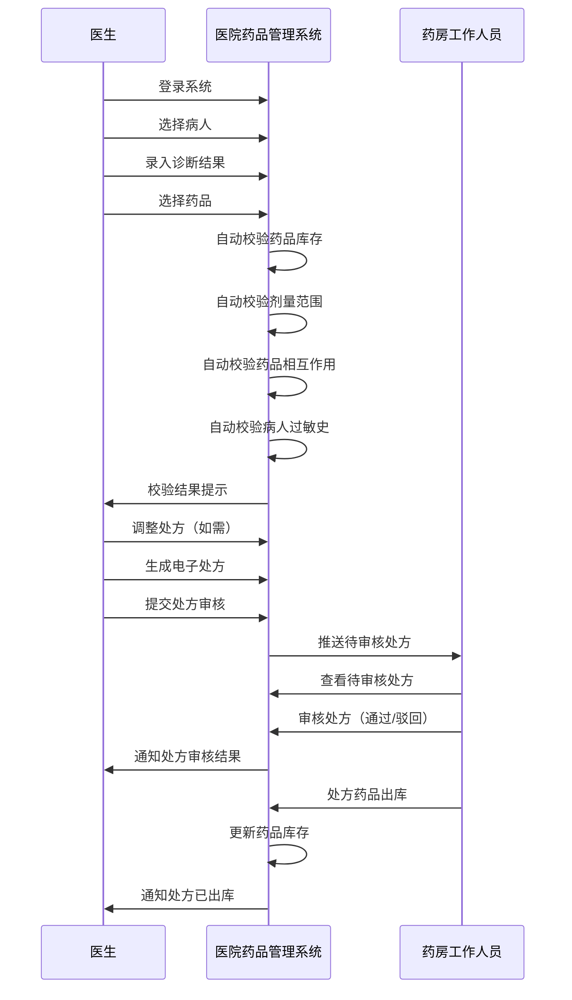
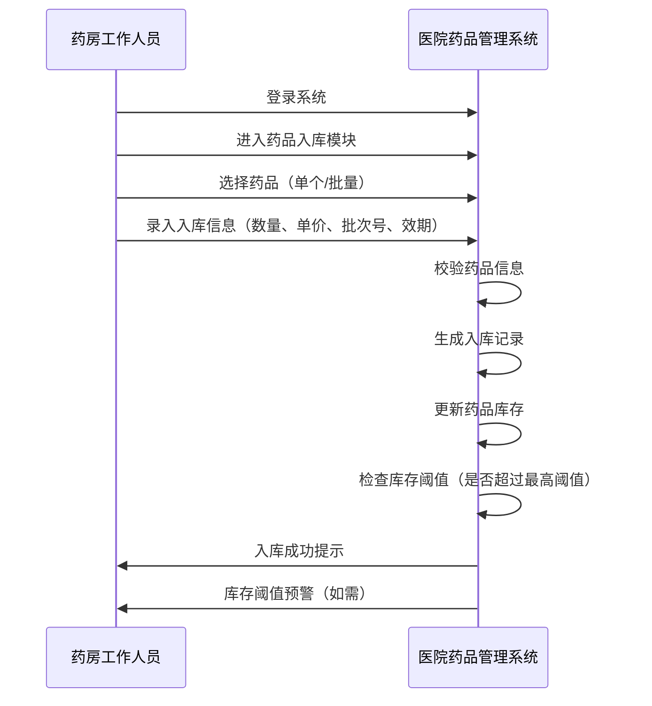
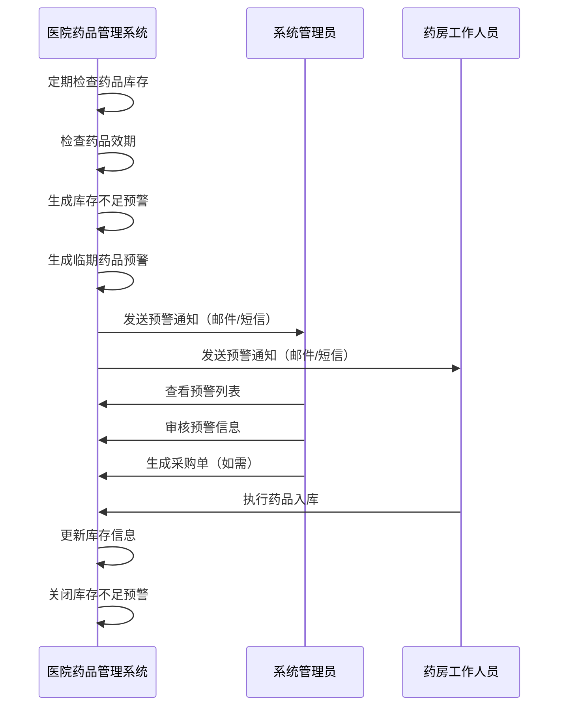

# 医院药品管理系统 - 详细总体需求文档

## 1. 文档概述

### 1.1 文档目的
本需求规格说明书详细定义医院药品管理系统的功能需求、非功能需求、数据需求、业务流程等内容，为系统设计、开发、测试和验收提供完整依据，确保系统满足10+医院、100+医生的药品管理、人员管理及业务流转核心需求。

### 1.2 目标用户
- **医生**：系统主要操作用户，负责药品查询、处方开具、病人信息管理等日常业务
- **系统管理员**：医院信息科工作人员，负责系统配置、权限管理、数据维护等
- **药房工作人员**：负责药品入库、出库、库存管理等操作

### 1.3 系统范围
覆盖药品管理、药品库存管理、病人管理、医院管理、医生管理五大核心模块，支持医生日常开方、药品查询、病人信息调取等操作，同时满足医院对药品、人员、库存的统一管控需求。

### 1.4 系统定位
- 为医院提供一体化的药品全生命周期管理解决方案
- 实现药品从采购入库到处方出库的全程可追溯
- 辅助医生规范用药，减少用药错误
- 提升医院药品管理效率和精细化程度

## 2. 功能需求

### 2.1 药品管理模块

#### 2.1.1 药品信息维护
| 功能点 | 详细需求 | 优先级 | 备注 |
| ---- | ---- | ---- | ---- |
| 药品基本信息管理 | 支持医生/管理员新增、编辑、删除、查询药品信息，信息字段包括： - 基础信息：药品编码、通用名、商品名、规格、剂型、生产厂家、批准文号 - 分类信息：药品类型（中药|西药|中成药）、药理分类、剂型分类、科室分类 - 用途信息：药品用途、使用方式 - 效期信息：有效期起始日期、有效期截止日期 - 价格信息：零售价、批发价、医保报销比例 - 状态信息：正常/停用/缺货 | 高 | 药品编码自动生成，支持自定义规则，药品类型、用途、使用方式通过字典模块管理 |
| 药品图片上传 | 支持上传药品包装盒图片、说明书图片，方便医生直观识别 | 中 | 支持JPG、PNG格式，单张图片≤2MB |
| 药品批量导入导出 | 支持Excel格式的药品信息批量导入导出，包括模板下载、导入校验、错误提示 | 高 | 支持1000条/次的批量操作 |
| 药品状态管理 | 支持药品状态标记（正常/停用/缺货），停用药品不可用于开方，缺货药品开方时提示 | 高 | 状态变更需记录操作日志 |
| 药品审核流程 | 新增或修改药品信息需经管理员审核后生效（可配置审核流程） | 中 | 支持审核通过/驳回，带审核意见 |

#### 2.1.2 药品分类管理
| 功能点 | 详细需求 | 优先级 | 备注 |
| ---- | ---- | ---- | ---- |
| 多维度分类 | 支持按药理作用、剂型、使用科室等维度对药品进行分类 | 高 | 支持自定义分类维度 |
| 分类层级管理 | 支持自定义分类层级（最多5级），如“抗菌药物-头孢类-头孢克肟” | 高 | 支持拖拽调整分类顺序 |
| 分类查询统计 | 支持按分类查询药品数量、库存情况，生成分类统计报表 | 中 | 支持导出分类统计数据 |
| 分类权限控制 | 支持配置科室可使用的药品分类范围，限制跨科室超范围开方 | 高 | 与医生所属科室关联 |

#### 2.1.3 药品处方规则设置
| 功能点 | 详细需求 | 优先级 | 备注 |
| ---- | ---- | ---- | ---- |
| 剂量规则配置 | 支持配置药品处方剂量上限、下限，超出范围时系统自动提示或拦截 | 高 | 支持按年龄、体重、肝肾功能等条件设置不同剂量规则 |
| 禁忌规则配置 | 支持配置药品禁忌提示（如孕妇禁用、肝肾功能不全者慎用），开方时触发预警 | 高 | 支持多条件组合配置 |
| 相互作用规则配置 | 支持配置药品相互作用提醒，当处方中存在冲突药品时自动告警 | 高 | 支持严重程度分级（提示/警告/拦截） |
| 过敏史关联规则 | 自动关联病人过敏史，当开具过敏药品时强制拦截并提示 | 高 | 支持过敏类型（药物、食物、花粉等）细分 |
| 处方频率规则 | 支持配置药品处方频率限制（如每日最多开具次数） | 中 | 防止滥用药物 |

### 2.2 药品库存管理模块

#### 2.2.1 库存查询与管理
| 功能点 | 详细需求 | 优先级 | 备注 |
| ---- | ---- | ---- | ---- |
| 实时库存查询 | 支持按药品名称、规格、生产厂家、库存位置等条件模糊查询实时库存 | 高 | 响应时间≤1秒 |
| 库存详情查看 | 支持查看药品库存详情，包括库存数量、库存位置、效期分布、库存变动记录 | 高 | 支持分页和排序 |
| 库存调整 | 支持手动调整库存数量，需填写调整原因并记录操作日志 | 高 | 调整后需生成库存变动记录 |
| 库存盘点 | 支持定期库存盘点，生成盘点差异报告，支持盘盈盘亏处理 | 高 | 支持Excel导入盘点数据 |
| 库存冻结/解冻 | 支持对特定药品库存进行冻结/解冻操作，冻结状态药品不可出库 | 中 | 用于药品质量问题处理 |

#### 2.2.2 效期管理
| 功能点 | 详细需求 | 优先级 | 备注 |
| ---- | ---- | ---- | ---- |
| 效期预警设置 | 支持自定义效期预警天数（默认3个月），可按药品类型设置不同预警天数 | 高 | 支持多级预警（红色/黄色/绿色） |
| 效期预警提醒 | 系统自动对近效期药品进行预警，在库存列表中高亮显示，并发送邮件/短信提醒 | 高 | 支持预警消息推送 |
| 效期排序与筛选 | 支持按效期排序，优先提示临期药品的使用建议，支持按效期范围筛选 | 高 | 支持Excel导出临期药品列表 |
| 临期药品处理 | 支持临期药品登记和报废处理流程，生成报废记录和报表 | 高 | 报废需经过审核流程 |

#### 2.2.3 库存预警
| 功能点 | 详细需求 | 优先级 | 备注 |
| ---- | ---- | ---- | ---- |
| 阈值设置 | 支持为每个药品设置最低库存阈值和最高库存阈值，可按药房设置不同阈值 | 高 | 支持批量设置阈值 |
| 库存不足预警 | 当库存低于最低阈值时，系统自动生成补货提醒，支持邮件/短信通知 | 高 | 支持按优先级排序提醒 |
| 库存积压预警 | 当库存高于最高阈值时，系统提示库存积压风险，生成积压药品报表 | 中 | 支持积压原因分析 |
| 预警历史记录 | 保存所有预警记录，支持按时间、药品、药房等条件查询 | 中 | 支持导出预警历史 |

#### 2.2.4 出入库管理
| 功能点 | 详细需求 | 优先级 | 备注 |
| ---- | ---- | ---- | ---- |
| 药品入库 | 支持药品采购入库、调拨入库、退货入库等，记录入库时间、操作人员、数量、原因 | 高 | 支持关联采购订单 |
| 药品出库 | 支持处方出库、调拨出库、报废出库等，记录出库时间、操作人员、数量、原因 | 高 | 支持扫描条形码/二维码出库 |
| 出入库记录查询 | 支持按时间、药品、操作人员、出入库类型等条件查询出入库记录 | 高 | 支持导出出入库记录 |
| 处方关联出库 | 支持关联处方单号进行出库核销，确保处方药品与库存消耗一致 | 高 | 自动扣减对应药品库存 |
| 批次管理 | 支持药品批次管理，出入库时记录批次信息，支持按批次查询库存 | 高 | 效期管理基于批次 |

### 2.3 病人管理模块

#### 2.3.1 病人信息维护
| 功能点 | 详细需求 | 优先级 | 备注 |
| ---- | ---- | ---- | ---- |
| 病人基本信息管理 | 支持医生查询、查看病人基本信息，包括： - 身份信息：姓名、性别、年龄、身份证号、联系方式 - 就诊信息：病历号、就诊科室、诊断结果、就诊次数 - 健康信息：身高、体重、血型、既往病史 | 高 | 病人信息需加密存储 |
| 病人信息查询 | 支持按姓名、身份证号、病历号、联系方式等条件模糊查询病人信息 | 高 | 响应时间≤1秒 |
| 病人信息导入导出 | 支持批量导入导出病人信息，格式兼容Excel | 中 | 导入需进行数据校验 |
| 病人信息权限控制 | 仅授权医生可查看病人信息，支持按科室、医生等级设置查看权限 | 高 | 记录查看日志 |

#### 2.3.2 病人处方历史
| 功能点 | 详细需求 | 优先级 | 备注 |
| ---- | ---- | ---- | ---- |
| 处方历史查询 | 医生可查询病人历史处方记录，包括药品名称、剂量、用法、开具时间、疗效反馈等 | 高 | 支持按时间范围筛选 |
| 处方对比分析 | 支持对比病人不同时期的处方，辅助调整用药方案 | 中 | 支持可视化对比 |
| 疗效反馈记录 | 支持医生记录病人用药后的疗效反馈，包括不良反应、治疗效果等 | 中 | 反馈信息可用于药品评估 |

#### 2.3.3 过敏史管理
| 功能点 | 详细需求 | 优先级 | 备注 |
| ---- | ---- | ---- | ---- |
| 过敏史记录 | 支持记录病人药品过敏史，包括过敏药品名称、过敏反应、发生时间 | 高 | 支持关联处方规则 |
| 过敏史查询 | 支持按病人查询过敏史，过敏史信息在处方开具时自动提示 | 高 | 过敏史信息需加密存储 |
| 过敏史更新 | 支持医生更新病人过敏史，需记录更新时间和操作人员 | 高 | 更新后自动同步至处方规则 |

### 2.4 医院管理模块

#### 2.4.1 科室管理
| 功能点 | 详细需求 | 优先级 | 备注 |
| ---- | ---- | ---- | ---- |
| 科室基本信息管理 | 支持维护医院科室信息，包括科室编码、科室名称、科室类型（临床/医技/行政）、科室负责人、联系电话、科室位置 | 高 | 支持科室层级管理 |
| 科室药品权限配置 | 支持配置科室可使用的药品范围，限制跨科室超范围开方 | 高 | 与医生所属科室关联 |
| 科室人员管理 | 支持查看科室医生列表，管理科室人员分配 | 中 | 支持批量分配 |

#### 2.4.2 药房管理
| 功能点 | 详细需求 | 优先级 | 备注 |
| ---- | ---- | ---- | ---- |
| 药房基本信息管理 | 支持维护药房信息，包括药房编码、药房名称、药房类型（中药房|西药房）、所在楼层、负责科室、联系方式、负责人 | 高 | 支持多个药房管理，药房类型通过字典模块管理 |
| 药房药品权限配置 | 支持配置药房的药品调拨权限，实现药房间药品流转 | 高 | 支持跨药房调拨审批 |
| 药房人员管理 | 支持管理药房工作人员信息和权限 | 中 | 支持按药房分配权限 |

#### 2.4.3 基础数据配置
| 功能点 | 详细需求 | 优先级 | 备注 |
| ---- | ---- | ---- | ---- |
| 系统参数配置 | 支持维护医院基础参数，如： - 处方有效期（默认7天） - 药品价格调整周期 - 库存盘点周期（默认1个月） - 效期预警天数 - 库存阈值比例 | 高 | 支持参数修改记录 |
| 编码规则配置 | 支持配置药品编码、处方单号、病历号等的生成规则 | 中 | 支持自定义规则 |
| 日志配置 | 支持配置系统操作日志的保存时长（默认10年），满足医疗数据合规要求 | 高 | 支持日志备份策略 |

### 2.5 字典管理模块

#### 2.5.1 字典类型管理
| 功能点 | 详细需求 | 优先级 | 备注 |
| ---- | ---- | ---- | ---- |
| 字典类型维护 | 支持管理员新增、编辑、删除、查询字典类型，包括字典类型编码、名称、描述、状态等 | 高 | 字典类型用于分类管理字典项 |
| 字典类型状态管理 | 支持启用/禁用字典类型，禁用后的字典类型不可用于业务模块 | 高 | 需记录状态变更日志 |

#### 2.5.2 字典项管理
| 功能点 | 详细需求 | 优先级 | 备注 |
| ---- | ---- | ---- | ---- |
| 字典项维护 | 支持管理员新增、编辑、删除、查询字典项，包括字典项编码、名称、值、排序、状态等 | 高 | 字典项关联到字典类型 |
| 字典项排序 | 支持自定义字典项排序，影响业务模块中的显示顺序 | 中 | 支持拖拽排序 |
| 字典项状态管理 | 支持启用/禁用字典项，禁用后的字典项不可用于业务模块 | 高 | 需记录状态变更日志 |

#### 2.5.3 字典应用
| 功能点 | 详细需求 | 优先级 | 备注 |
| ---- | ---- | ---- | ---- |
| 字典数据同步 | 支持字典数据实时同步到前端，确保前端展示的字典数据与后端一致 | 高 | 可通过WebSocket或定时刷新实现 |
| 字典数据缓存 | 支持字典数据缓存，提高系统响应速度 | 高 | 使用Redis缓存字典数据 |
| 字典数据校验 | 业务模块使用字典数据时，自动校验数据有效性 | 高 | 确保业务数据的合法性 |

### 2.6 医生管理模块

#### 2.6.1 医生信息维护
| 功能点 | 详细需求 | 优先级 | 备注 |
| ---- | ---- | ---- | ---- |
| 医生基本信息管理 | 支持管理员维护医生信息，包括： - 身份信息：医生工号、姓名、性别、职称、执业类别、执业范围 - 工作信息：所属科室、入职时间、联系电话、邮箱 - 认证信息：执业医师证号、资格证号 | 高 | 支持批量导入医生信息 |
| 医生头像与签名 | 支持医生头像上传和个人电子签名录入，处方中可显示电子签名 | 高 | 支持手写签名上传 |
| 医生状态管理 | 支持医生账号的启用/禁用，禁用账号不可登录系统 | 高 | 需记录状态变更原因 |

#### 2.5.2 权限管理
| 功能点 | 详细需求 | 优先级 | 备注 |
| ---- | ---- | ---- | ---- |
| 基于角色的权限控制（RBAC） | 支持角色创建、编辑、删除，角色权限包括： - 医生默认权限：药品查询、病人信息查询、处方开具、处方历史查询 - 管理员权限：系统配置、用户管理、数据维护 - 药房权限：库存管理、出入库操作 | 高 | 支持细粒度权限控制 |
| 特殊药品权限配置 | 支持细分权限配置，如部分医生仅可开具普通药品处方，特殊药品（如麻醉药品、精神药品）需额外授权 | 高 | 支持权限有效期设置 |
| 权限变更记录 | 支持权限的授予、回收和变更记录，包括变更时间、操作人员、变更内容 | 高 | 记录不可篡改 |
| 权限继承与覆盖 | 支持角色权限的继承和覆盖，简化权限管理 | 中 | 支持权限冲突检测 |

#### 2.5.3 处方统计与报表
| 功能点 | 详细需求 | 优先级 | 备注 |
| ---- | ---- | ---- | ---- |
| 个人处方统计 | 支持医生查询个人处方统计数据，包括开具处方数量、涉及药品种类、处方审核通过率等 | 高 | 支持按时间维度（日/周/月/年）生成统计报表 |
| 科室处方统计 | 支持查询科室处方统计数据，包括科室处方总量、平均处方金额、常用药品TOP10等 | 中 | 支持图表可视化 |
| 医院处方统计 | 支持查询医院处方统计数据，包括全院处方总量、药品使用排名、处方审核通过率等 | 中 | 支持Excel和PDF导出 |
| 处方审核统计 | 支持统计处方审核情况，包括审核通过数、驳回数、驳回原因分布等 | 高 | 支持实时更新 |

### 2.7 处方管理模块

#### 2.7.1 处方开具
| 功能点 | 详细需求 | 优先级 | 备注 |
| ---- | ---- | ---- | ---- |
| 电子处方生成 | 支持医生选择病人→录入诊断结果→选择药品（系统自动校验库存、禁忌、剂量）→生成电子处方 | 高 | 支持模板处方快速生成 |
| 处方药品选择 | 支持按药品名称、分类、厂家等条件快速搜索药品，支持药品收藏功能 | 高 | 支持药品模糊匹配 |
| 处方剂量自动计算 | 支持根据病人年龄、体重自动计算药品推荐剂量 | 中 | 支持手动调整 |
| 处方审核规则校验 | 处方开具时自动校验： - 药品库存是否充足 - 剂量是否在合理范围 - 是否存在药品相互作用 - 是否为病人过敏药品 - 是否符合科室药品权限 | 高 | 校验不通过时提示具体原因 |

#### 2.7.2 处方审核与流转
| 功能点 | 详细需求 | 优先级 | 备注 |
| ---- | ---- | ---- | ---- |
| 处方提交审核 | 医生开具处方后提交药房审核，审核状态包括：待审核、审核通过、审核驳回 | 高 | 支持审核意见填写 |
| 处方审核处理 | 药房工作人员可查看待审核处方，进行审核通过或驳回操作，需填写审核意见 | 高 | 支持批量审核 |
| 处方状态查询 | 支持医生和药房工作人员查询处方状态，包括开具时间、审核时间、出库时间等 | 高 | 支持实时状态更新 |
| 处方打印 | 支持电子处方打印，包含药品信息、剂量、用法、医生签名、审核人员签名等 | 高 | 支持自定义打印模板 |

#### 2.7.3 处方历史管理
| 功能点 | 详细需求 | 优先级 | 备注 |
| ---- | ---- | ---- | ---- |
| 处方归档 | 处方完成后自动归档，支持按时间、病人、医生、科室等条件查询 | 高 | 支持批量归档 |
| 处方检索 | 支持按处方单号、病人姓名、药品名称等条件检索处方 | 高 | 响应时间≤2秒 |
| 处方数据分析 | 支持处方数据分析，包括药品使用趋势、处方金额分布、医生开方习惯等 | 中 | 支持图表可视化 |

## 3. 非功能需求

### 3.1 性能需求
| 需求点 | 详细要求 | 优先级 | 备注 |
| ---- | ---- | ---- | ---- |
| 响应时间 | - 药品查询、病人信息查询等操作响应时间≤1秒 - 处方开具提交响应时间≤2秒 - 报表生成响应时间≤5秒 | 高 | 在50并发用户下测试 |
| 并发处理能力 | 支持≥50名医生同时在线操作，系统无卡顿、崩溃现象 | 高 | 支持横向扩展 |
| 数据存储能力 | 支持存储≥10年的药品信息、处方记录、病人信息等数据 | 高 | 支持数据归档策略 |
| 数据处理能力 | 支持每日处理≥1000张处方，≥10000条库存变动记录 | 高 | 支持批量处理 |

### 3.2 安全性需求
| 需求点 | 详细要求 | 优先级 | 备注 |
| ---- | ---- | ---- | ---- |
| 身份认证 | - 采用用户名+密码+验证码的登录方式 - 支持单点登录（SSO）集成医院现有认证系统 - 登录失败次数限制（默认5次，锁定30分钟） | 高 | 支持LDAP集成 |
| 数据加密 | - 病人隐私信息、处方数据采用AES-256加密算法存储 - 传输数据采用HTTPS协议 - 敏感数据脱敏显示（如身份证号、手机号） | 高 | 支持数据加密密钥定期更换 |
| 操作日志 | - 记录所有用户的操作行为，包括登录时间、操作内容、修改数据前后对比 - 日志不可篡改，支持日志审计 - 日志保存时长≥10年 | 高 | 支持日志备份和恢复 |
| 权限控制 | - 基于nest-admin的RBAC权限管理，严格遵循最小权限原则，防止越权操作 - 支持IP白名单设置 - 支持操作超时自动登出（默认30分钟） | 高 | 支持细粒度权限控制 |
| 数据备份与恢复 | - 支持每日自动备份数据 - 支持增量备份和全量备份 - 支持数据快速恢复（恢复时间≤1小时） | 高 | 支持异地备份 |

### 3.3 兼容性需求
| 需求点 | 详细要求 | 优先级 | 备注 |
| ---- | ---- | ---- | ---- |
| 浏览器兼容性 | 支持Chrome、Firefox、Edge、Safari等主流浏览器，版本兼容近3个稳定版本 | 高 | 支持响应式设计 |
| 设备兼容性 | - 支持PC端、平板端操作，界面自适应不同分辨率 - 支持web、app、小程序多端访问 | 高 | 支持移动端触控操作 |
| 操作系统兼容性 | 支持Windows、macOS、Linux等主流操作系统 | 中 | 支持Docker部署 |
| 数据库兼容性 | 支持MySQL 8.0+，支持Redis 6+用于缓存 | 高 | 支持数据库读写分离 |

### 3.4 易用性需求
| 需求点 | 详细要求 | 优先级 | 备注 |
| ---- | ---- | ---- | ---- |
| 界面设计 | 界面设计符合医疗行业操作习惯，简洁明了，减少医生操作步骤，支持自定义工作台 | 高 | 支持暗黑模式 |
| 操作指引 | 提供操作指引和帮助文档，支持新手引导功能，支持在线客服 | 中 | 支持视频教程 |
| 错误提示 | 系统报错信息明确，提供解决方案提示，支持错误日志收集 | 高 | 支持一键反馈问题 |
| 操作效率 | 支持快捷键操作，支持常用功能快速访问，支持模板化操作 | 高 | 支持批量操作 |

### 3.5 可靠性需求
| 需求点 | 详细要求 | 优先级 | 备注 |
| ---- | ---- | ---- | ---- |
| 系统可用性 | 系统可用性≥99.9%，计划内停机时间≤4小时/年 | 高 | 支持故障自动切换 |
| 系统稳定性 | 支持连续稳定运行72小时无故障，并发用户数达到设计上限时性能指标满足要求 | 高 | 支持压力测试 |
| 错误恢复能力 | 系统出现错误后能自动恢复，不影响其他功能正常运行，支持错误日志自动收集 | 高 | 支持自动报警 |

### 3.6 可扩展性需求
| 需求点 | 详细要求 | 优先级 | 备注 |
| ---- | ---- | ---- | ---- |
| 模块化设计 | 系统采用模块化设计，支持功能模块的独立部署和扩展 | 高 | 支持微服务架构 |
| API接口设计 | 提供完整的RESTful API接口，支持第三方系统集成 | 高 | 支持API文档自动生成 |
| 数据接口标准 | 支持HL7、DICOM等医疗行业数据标准，支持与医院HIS系统集成 | 中 | 支持数据格式转换 |

## 4. 数据需求

### 4.1 数据实体及属性

#### 4.1.1 药品表（drugs）
| 字段名 | 数据类型 | 长度 | 约束 | 描述 |
| ---- | ---- | ---- | ---- | ---- |
| drug_id | VARCHAR | 32 | PRIMARY KEY | 药品ID（UUID） |
| drug_code | VARCHAR | 20 | UNIQUE NOT NULL | 药品编码 |
| generic_name | VARCHAR | 100 | NOT NULL | 通用名 |
| trade_name | VARCHAR | 100 | | 商品名 |
| specification | VARCHAR | 50 | NOT NULL | 规格 |
| dosage_form | VARCHAR | 20 | NOT NULL | 剂型 |
| manufacturer | VARCHAR | 100 | NOT NULL | 生产厂家 |
| approval_number | VARCHAR | 50 | NOT NULL | 批准文号 |
| drug_type | VARCHAR | 20 | NOT NULL | 药品类型（中药|西药|中成药，关联字典） |
| use_purpose | TEXT | | | 药品用途（关联字典） |
| usage_method | TEXT | | | 使用方式（关联字典） |
| valid_from | DATE | | NOT NULL | 有效期起始日期 |
| valid_to | DATE | | NOT NULL | 有效期截止日期 |
| retail_price | DECIMAL | 10,2 | NOT NULL | 零售价 |
| wholesale_price | DECIMAL | 10,2 | NOT NULL | 批发价 |
| medical_insurance_rate | DECIMAL | 5,2 | | 医保报销比例 |
| pharmacological_class | VARCHAR | 50 | | 药理分类 |
| dosage_class | VARCHAR | 50 | | 剂型分类 |
| department_class | VARCHAR | 50 | | 科室分类 |
| status | VARCHAR | 10 | NOT NULL DEFAULT 'normal' | 状态（normal/stopped/out_of_stock） |
| created_at | TIMESTAMP | | NOT NULL DEFAULT CURRENT_TIMESTAMP | 创建时间 |
| updated_at | TIMESTAMP | | NOT NULL DEFAULT CURRENT_TIMESTAMP | 更新时间 |
| created_by | VARCHAR | 32 | | 创建人ID |
| updated_by | VARCHAR | 32 | | 更新人ID |

#### 4.1.2 库存表（inventory）
| 字段名 | 数据类型 | 长度 | 约束 | 描述 |
| ---- | ---- | ---- | ---- | ---- |
| inventory_id | VARCHAR | 32 | PRIMARY KEY | 库存ID（UUID） |
| drug_id | VARCHAR | 32 | FOREIGN KEY | 药品ID |
| pharmacy_id | VARCHAR | 32 | FOREIGN KEY | 药房ID |
| batch_number | VARCHAR | 50 | NOT NULL | 批次号 |
| quantity | INT | | NOT NULL DEFAULT 0 | 库存数量 |
| minimum_threshold | INT | | NOT NULL DEFAULT 0 | 最低库存阈值 |
| maximum_threshold | INT | | NOT NULL DEFAULT 1000 | 最高库存阈值 |
| storage_location | VARCHAR | 100 | | 库存位置 |
| valid_from | DATE | | NOT NULL | 有效期起始日期 |
| valid_to | DATE | | NOT NULL | 有效期截止日期 |
| is_frozen | BOOLEAN | | NOT NULL DEFAULT FALSE | 是否冻结 |
| created_at | TIMESTAMP | | NOT NULL DEFAULT CURRENT_TIMESTAMP | 创建时间 |
| updated_at | TIMESTAMP | | NOT NULL DEFAULT CURRENT_TIMESTAMP | 更新时间 |
| updated_by | VARCHAR | 32 | | 更新人ID |

#### 4.1.3 病人表（patients）
| 字段名 | 数据类型 | 长度 | 约束 | 描述 |
| ---- | ---- | ---- | ---- | ---- |
| patient_id | VARCHAR | 32 | PRIMARY KEY | 病人ID（UUID） |
| medical_record_number | VARCHAR | 20 | UNIQUE NOT NULL | 病历号 |
| name | VARCHAR | 50 | NOT NULL | 姓名 |
| gender | VARCHAR | 10 | NOT NULL | 性别 |
| age | INT | | NOT NULL | 年龄 |
| id_card | VARCHAR | 18 | UNIQUE | 身份证号（加密存储） |
| phone | VARCHAR | 20 | | 联系方式（加密存储） |
| height | DECIMAL | 5,2 | | 身高（cm） |
| weight | DECIMAL | 5,2 | | 体重（kg） |
| blood_type | VARCHAR | 10 | | 血型 |
| allergy_history | TEXT | | | 过敏史（JSON格式） |
| medical_history | TEXT | | | 既往病史 |
| created_at | TIMESTAMP | | NOT NULL DEFAULT CURRENT_TIMESTAMP | 创建时间 |
| updated_at | TIMESTAMP | | NOT NULL DEFAULT CURRENT_TIMESTAMP | 更新时间 |
| created_by | VARCHAR | 32 | | 创建人ID |
| updated_by | VARCHAR | 32 | | 更新人ID |

#### 4.1.4 处方表（prescriptions）
| 字段名 | 数据类型 | 长度 | 约束 | 描述 |
| ---- | ---- | ---- | ---- | ---- |
| prescription_id | VARCHAR | 32 | PRIMARY KEY | 处方ID（UUID） |
| prescription_number | VARCHAR | 30 | UNIQUE NOT NULL | 处方单号 |
| patient_id | VARCHAR | 32 | FOREIGN KEY | 病人ID |
| doctor_id | VARCHAR | 32 | FOREIGN KEY | 医生ID |
| department_id | VARCHAR | 32 | FOREIGN KEY | 就诊科室ID |
| diagnosis | TEXT | | NOT NULL | 诊断结果 |
| total_amount | DECIMAL | 10,2 | NOT NULL | 处方总金额 |
| status | VARCHAR | 20 | NOT NULL DEFAULT 'pending_review' | 状态（pending_review/reviewed/rejected/dispensed/cancelled） |
| review_comments | TEXT | | | 审核意见 |
| review_by | VARCHAR | 32 | | 审核人ID |
| review_time | TIMESTAMP | | | 审核时间 |
| created_at | TIMESTAMP | | NOT NULL DEFAULT CURRENT_TIMESTAMP | 创建时间 |
| updated_at | TIMESTAMP | | NOT NULL DEFAULT CURRENT_TIMESTAMP | 更新时间 |

#### 4.1.5 处方药品表（prescription_drugs）
| 字段名 | 数据类型 | 长度 | 约束 | 描述 |
| ---- | ---- | ---- | ---- | ---- |
| id | VARCHAR | 32 | PRIMARY KEY | 记录ID（UUID） |
| prescription_id | VARCHAR | 32 | FOREIGN KEY | 处方ID |
| drug_id | VARCHAR | 32 | FOREIGN KEY | 药品ID |
| dosage | DECIMAL | 10,2 | NOT NULL | 剂量 |
| dosage_unit | VARCHAR | 20 | NOT NULL | 剂量单位 |
| frequency | VARCHAR | 20 | NOT NULL | 用药频率 |
| administration_route | VARCHAR | 20 | NOT NULL | 给药途径 |
| duration | INT | NOT NULL | 用药天数 |
| quantity | INT | NOT NULL | 数量 |
| unit_price | DECIMAL | 10,2 | NOT NULL | 单价 |
| total_price | DECIMAL | 10,2 | NOT NULL | 总价 |
| created_at | TIMESTAMP | | NOT NULL DEFAULT CURRENT_TIMESTAMP | 创建时间 |

#### 4.1.6 医生表（doctors）
| 字段名 | 数据类型 | 长度 | 约束 | 描述 |
| ---- | ---- | ---- | ---- | ---- |
| doctor_id | VARCHAR | 32 | PRIMARY KEY | 医生ID（UUID） |
| doctor_code | VARCHAR | 20 | UNIQUE NOT NULL | 医生工号 |
| name | VARCHAR | 50 | NOT NULL | 姓名 |
| gender | VARCHAR | 10 | NOT NULL | 性别 |
| title | VARCHAR | 20 | NOT NULL | 职称 |
| practice_type | VARCHAR | 20 | NOT NULL | 执业类别 |
| practice_scope | TEXT | | NOT NULL | 执业范围 |
| department_id | VARCHAR | 32 | FOREIGN KEY | 所属科室ID |
| phone | VARCHAR | 20 | | 联系电话 |
| email | VARCHAR | 100 | | 邮箱 |
| avatar | VARCHAR | 255 | | 头像URL |
| signature | VARCHAR | 255 | | 电子签名URL |
| password_hash | VARCHAR | 255 | NOT NULL | 密码哈希 |
| status | VARCHAR | 10 | NOT NULL DEFAULT 'active' | 状态（active/inactive） |
| created_at | TIMESTAMP | | NOT NULL DEFAULT CURRENT_TIMESTAMP | 创建时间 |
| updated_at | TIMESTAMP | | NOT NULL DEFAULT CURRENT_TIMESTAMP | 更新时间 |
| created_by | VARCHAR | 32 | | 创建人ID |
| updated_by | VARCHAR | 32 | | 更新人ID |

#### 4.1.7 医院表（hospitals）
| 字段名 | 数据类型 | 长度 | 约束 | 描述 |
| ---- | ---- | ---- | ---- | ---- |
| hospital_id | VARCHAR | 32 | PRIMARY KEY | 医院ID（UUID） |
| hospital_code | VARCHAR | 20 | UNIQUE NOT NULL | 医院编码 |
| name | VARCHAR | 100 | NOT NULL | 医院名称 |
| address | VARCHAR | 255 | NOT NULL | 医院地址 |
| phone | VARCHAR | 20 | NOT NULL | 联系电话 |
| contact_person | VARCHAR | 50 | NOT NULL | 联系人 |
| level | VARCHAR | 20 | | 医院等级 |
| created_at | TIMESTAMP | | NOT NULL DEFAULT CURRENT_TIMESTAMP | 创建时间 |
| updated_at | TIMESTAMP | | NOT NULL DEFAULT CURRENT_TIMESTAMP | 更新时间 |

#### 4.1.8 科室表（departments）
| 字段名 | 数据类型 | 长度 | 约束 | 描述 |
| ---- | ---- | ---- | ---- | ---- |
| department_id | VARCHAR | 32 | PRIMARY KEY | 科室ID（UUID） |
| department_code | VARCHAR | 20 | UNIQUE NOT NULL | 科室编码 |
| name | VARCHAR | 50 | NOT NULL | 科室名称 |
| type | VARCHAR | 20 | NOT NULL | 科室类型（clinical/medical_tech/admin） |
| hospital_id | VARCHAR | 32 | FOREIGN KEY | 所属医院ID |
| parent_id | VARCHAR | 32 | | 父科室ID |
| director | VARCHAR | 50 | | 科室负责人 |
| phone | VARCHAR | 20 | | 联系电话 |
| location | VARCHAR | 100 | | 科室位置 |
| created_at | TIMESTAMP | | NOT NULL DEFAULT CURRENT_TIMESTAMP | 创建时间 |
| updated_at | TIMESTAMP | | NOT NULL DEFAULT CURRENT_TIMESTAMP | 更新时间 |

#### 4.1.9 药房表（pharmacies）
| 字段名 | 数据类型 | 长度 | 约束 | 描述 |
| ---- | ---- | ---- | ---- | ---- |
| pharmacy_id | VARCHAR | 32 | PRIMARY KEY | 药房ID（UUID） |
| pharmacy_code | VARCHAR | 20 | UNIQUE NOT NULL | 药房编码 |
| name | VARCHAR | 50 | NOT NULL | 药房名称 |
| hospital_id | VARCHAR | 32 | FOREIGN KEY | 所属医院ID |
| pharmacy_type | VARCHAR | 20 | NOT NULL | 药房类型（中药房|西药房，关联字典） |
| floor | VARCHAR | 10 | | 所在楼层 |
| department_id | VARCHAR | 32 | FOREIGN KEY | 负责科室ID |
| contact_person | VARCHAR | 50 | | 联系人 |
| phone | VARCHAR | 20 | | 联系电话 |
| created_at | TIMESTAMP | | NOT NULL DEFAULT CURRENT_TIMESTAMP | 创建时间 |
| updated_at | TIMESTAMP | | NOT NULL DEFAULT CURRENT_TIMESTAMP | 更新时间 |

#### 4.1.10 出入库记录表（inventory_transactions）
| 字段名 | 数据类型 | 长度 | 约束 | 描述 |
| ---- | ---- | ---- | ---- | ---- |
| transaction_id | VARCHAR | 32 | PRIMARY KEY | 交易ID（UUID） |
| drug_id | VARCHAR | 32 | FOREIGN KEY | 药品ID |
| pharmacy_id | VARCHAR | 32 | FOREIGN KEY | 药房ID |
| transaction_type | VARCHAR | 20 | NOT NULL | 交易类型（inbound/outbound/transfer/adjustment） |
| quantity | INT | NOT NULL | 数量 |
| unit_price | DECIMAL | 10,2 | NOT NULL | 单价 |
| total_amount | DECIMAL | 10,2 | NOT NULL | 总价 |
| batch_number | VARCHAR | 50 | | 批次号 |
| reason | TEXT | | | 交易原因 |
| reference_id | VARCHAR | 32 | | 关联ID（如处方ID、采购订单ID） |
| created_by | VARCHAR | 32 | NOT NULL | 操作人ID |
| created_at | TIMESTAMP | | NOT NULL DEFAULT CURRENT_TIMESTAMP | 操作时间 |

#### 4.1.11 字典类型表（dict_types）
| 字段名 | 数据类型 | 长度 | 约束 | 描述 |
| ---- | ---- | ---- | ---- | ---- |
| dict_type_id | VARCHAR | 32 | PRIMARY KEY | 字典类型ID（UUID） |
| dict_type_code | VARCHAR | 50 | UNIQUE NOT NULL | 字典类型编码 |
| dict_type_name | VARCHAR | 100 | NOT NULL | 字典类型名称 |
| description | TEXT | | | 字典类型描述 |
| status | VARCHAR | 10 | NOT NULL DEFAULT 'active' | 状态（active/inactive） |
| sort_order | INT | | NOT NULL DEFAULT 0 | 排序顺序 |
| created_at | TIMESTAMP | | NOT NULL DEFAULT CURRENT_TIMESTAMP | 创建时间 |
| updated_at | TIMESTAMP | | NOT NULL DEFAULT CURRENT_TIMESTAMP | 更新时间 |
| created_by | VARCHAR | 32 | | 创建人ID |
| updated_by | VARCHAR | 32 | | 更新人ID |

#### 4.1.12 字典项表（dict_items）
| 字段名 | 数据类型 | 长度 | 约束 | 描述 |
| ---- | ---- | ---- | ---- | ---- |
| dict_item_id | VARCHAR | 32 | PRIMARY KEY | 字典项ID（UUID） |
| dict_type_id | VARCHAR | 32 | FOREIGN KEY | 字典类型ID |
| dict_item_code | VARCHAR | 50 | NOT NULL | 字典项编码 |
| dict_item_name | VARCHAR | 100 | NOT NULL | 字典项名称 |
| dict_item_value | TEXT | | | 字典项值 |
| description | TEXT | | | 字典项描述 |
| status | VARCHAR | 10 | NOT NULL DEFAULT 'active' | 状态（active/inactive） |
| sort_order | INT | | NOT NULL DEFAULT 0 | 排序顺序 |
| created_at | TIMESTAMP | | NOT NULL DEFAULT CURRENT_TIMESTAMP | 创建时间 |
| updated_at | TIMESTAMP | | NOT NULL DEFAULT CURRENT_TIMESTAMP | 更新时间 |
| created_by | VARCHAR | 32 | | 创建人ID |
| updated_by | VARCHAR | 32 | | 更新人ID |

### 4.2 数据约束

1. **唯一性约束**：
   - 药品编码（drug_code）在全院范围内唯一
   - 病历号（medical_record_number）在全院范围内唯一
   - 医生工号（doctor_code）在全院范围内唯一
   - 处方单号（prescription_number）在全院范围内唯一
   - 医院编码（hospital_code）唯一
   - 科室编码（department_code）在医院内唯一
   - 药房编码（pharmacy_code）在医院内唯一
   - 字典类型编码（dict_type_code）唯一
   - 字典项编码（dict_item_code）在同一字典类型内唯一

2. **外键约束**：
   - 处方表关联病人表、医生表、科室表
   - 处方药品表关联处方表、药品表
   - 库存表关联药品表、药房表
   - 医生表关联科室表
   - 科室表关联医院表
   - 药房表关联医院表、科室表
   - 出入库记录表关联药品表、药房表
   - 字典项表关联字典类型表
   - 药品表关联字典表（药品类型、用途、使用方式）
   - 药房表关联字典表（药房类型）

3. **数据类型约束**：
   - 日期字段格式统一为"YYYY-MM-DD HH:MM:SS"
   - 金额字段精度为小数点后2位
   - 数量字段为非负整数

4. **状态约束**：
   - 药品状态：normal/stopped/out_of_stock
   - 处方状态：pending_review/reviewed/rejected/dispensed/cancelled
   - 医生状态：active/inactive
   - 科室类型：clinical/medical_tech/admin

## 5. 核心业务流程

### 5.1 处方开具流程

### 5.2 药品入库流程

### 5.3 库存预警处理流程

## 6. 验收标准

### 6.1 功能验收标准
1. 所有功能点均需通过黑盒测试，测试用例通过率100%
2. 核心业务流程（处方开具、药品入库、库存预警）测试覆盖度100%
3. 各角色权限测试覆盖度100%，无越权操作风险

### 6.2 性能验收标准
1. 系统响应时间：药品查询、病人信息查询等操作响应时间≤1秒，处方开具提交响应时间≤2秒
2. 并发处理能力：支持≥50名医生同时在线操作，系统无卡顿、崩溃现象
3. 系统连续稳定运行72小时无故障

### 6.3 安全性验收标准
1. 数据加密：病人隐私信息、处方数据采用AES加密算法存储，传输数据采用HTTPS协议
2. 操作日志：记录所有用户的操作行为，日志不可篡改
3. 权限控制：严格遵循最小权限原则，防止越权操作
4. 通过第三方安全检测，无高危漏洞

### 6.4 兼容性验收标准
1. 浏览器兼容性：支持Chrome、Firefox、Edge、Safari等主流浏览器，版本兼容近3个版本
2. 设备兼容性：支持PC端、平板端操作，界面自适应不同分辨率
3. 支持web、app、小程序多端访问，功能一致

### 6.5 易用性验收标准
1. 医生用户操作满意度≥90%（通过用户调研评估）
2. 系统报错信息明确，提供解决方案提示
3. 提供操作指引和帮助文档，支持新手引导功能

## 7. 附录

### 7.1 术语定义

| 术语 | 定义 |
| ---- | ---- |
| 电子处方 | 医生通过系统开具的数字化处方，具备法律效力 |
| 效期预警 | 系统对临近有效期的药品发出的提醒通知 |
| RBAC | 基于角色的访问控制，通过角色分配权限，简化权限管理 |
| 药品编码 | 用于唯一标识药品的编码，由系统或医院统一分配 |
| 病历号 | 用于唯一标识病人的编码，由医院统一分配 |
| 处方单号 | 用于唯一标识处方的编码，由系统自动生成 |
| HIS系统 | 医院信息系统（Hospital Information System） |
| HL7 | 医疗健康信息交换标准（Health Level Seven） |
| DICOM | 医学数字成像和通信标准（Digital Imaging and Communications in Medicine） |

### 7.2 参考文档

1. 《医疗机构药品监督管理办法》
2. 《电子病历应用管理规范》
3. 《信息安全技术 个人信息安全规范》（GB/T 35273-2020）
4. 《医院信息系统基本功能规范》（卫办发〔2002〕116号）
5. 《电子处方流转管理办法（试行）》（国卫办医函〔2020〕527号）
6. HL7 FHIR R4 标准
7. PostgreSQL 13 官方文档
8. Redis 6 官方文档
9. NestJS 官方文档
10. UniApp 官方文档
11. UmiJS 官方文档
