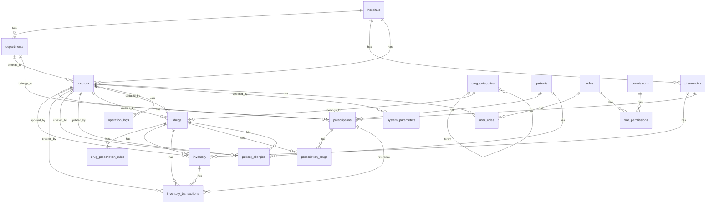

# 医院药品管理系统 - 数据库表结构方案

## 1. 文档概述

### 1.1 文档目的
本数据库表结构方案详细描述医院药品管理系统的数据库设计，包括表结构、字段定义、约束关系、索引设计等内容，为系统开发提供数据库层面的指导，确保数据库具备良好的性能、可扩展性和数据完整性。

### 1.2 设计原则

1. **关系型数据库设计原则**：遵循ER模型设计，确保数据的完整性和一致性
2. **第三范式**：尽量遵循第三范式设计，减少数据冗余
3. **高性能设计**：合理设计索引，提高查询性能
4. **可扩展性**：设计支持未来功能扩展，便于添加新字段和表
5. **安全性**：敏感数据加密存储，合理设置权限
6. **可读性**：表名和字段名命名规范，便于理解和维护

### 1.3 数据库选型

- **数据库类型**：MySQL 8.0+
- **存储引擎**：InnoDB
- **字符集**：UTF-8
- **排序规则**：utf8mb4_unicode_ci

## 2. 数据库表结构设计

### 2.1 医院相关表

#### 2.1.1 医院表（hospitals）

| 字段名 | 数据类型 | 长度 | 约束 | 描述 |
| ---- | ---- | ---- | ---- | ---- |
| hospital_id | UUID | | PRIMARY KEY | 医院ID |
| hospital_code | VARCHAR | 20 | UNIQUE NOT NULL | 医院编码 |
| name | VARCHAR | 100 | NOT NULL | 医院名称 |
| address | VARCHAR | 255 | NOT NULL | 医院地址 |
| phone | VARCHAR | 20 | NOT NULL | 联系电话 |
| contact_person | VARCHAR | 50 | NOT NULL | 联系人 |
| level | VARCHAR | 20 | | 医院等级 |
| description | TEXT | | | 医院描述 |
| created_at | TIMESTAMP | | NOT NULL DEFAULT CURRENT_TIMESTAMP | 创建时间 |
| updated_at | TIMESTAMP | | NOT NULL DEFAULT CURRENT_TIMESTAMP | 更新时间 |

**索引设计**：
- 主键索引：hospital_id
- 唯一索引：hospital_code
- 普通索引：name, phone

#### 2.1.2 科室表（departments）

| 字段名 | 数据类型 | 长度 | 约束 | 描述 |
| ---- | ---- | ---- | ---- | ---- |
| department_id | UUID | | PRIMARY KEY | 科室ID |
| department_code | VARCHAR | 20 | NOT NULL | 科室编码 |
| hospital_id | UUID | | FOREIGN KEY REFERENCES hospitals(hospital_id) | 所属医院ID |
| parent_id | UUID | | FOREIGN KEY REFERENCES departments(department_id) | 父科室ID |
| name | VARCHAR | 50 | NOT NULL | 科室名称 |
| type | VARCHAR | 20 | NOT NULL DEFAULT 'clinical' | 科室类型（clinical/medical_tech/admin） |
| director | VARCHAR | 50 | | 科室负责人 |
| phone | VARCHAR | 20 | | 联系电话 |
| location | VARCHAR | 100 | | 科室位置 |
| description | TEXT | | | 科室描述 |
| created_at | TIMESTAMP | | NOT NULL DEFAULT CURRENT_TIMESTAMP | 创建时间 |
| updated_at | TIMESTAMP | | NOT NULL DEFAULT CURRENT_TIMESTAMP | 更新时间 |

**索引设计**：
- 主键索引：department_id
- 唯一索引：(hospital_id, department_code) 联合唯一索引
- 普通索引：name, parent_id, hospital_id, type

#### 2.1.3 药房表（pharmacies）

| 字段名 | 数据类型 | 长度 | 约束 | 描述 |
| ---- | ---- | ---- | ---- | ---- |
| pharmacy_id | UUID | | PRIMARY KEY | 药房ID |
| pharmacy_code | VARCHAR | 20 | NOT NULL | 药房编码 |
| hospital_id | UUID | | FOREIGN KEY REFERENCES hospitals(hospital_id) | 所属医院ID |
| department_id | UUID | | FOREIGN KEY REFERENCES departments(department_id) | 负责科室ID |
| name | VARCHAR | 50 | NOT NULL | 药房名称 |
| floor | VARCHAR | 10 | | 所在楼层 |
| contact_person | VARCHAR | 50 | | 联系人 |
| phone | VARCHAR | 20 | | 联系电话 |
| description | TEXT | | | 药房描述 |
| created_at | TIMESTAMP | | NOT NULL DEFAULT CURRENT_TIMESTAMP | 创建时间 |
| updated_at | TIMESTAMP | | NOT NULL DEFAULT CURRENT_TIMESTAMP | 更新时间 |

**索引设计**：
- 主键索引：pharmacy_id
- 唯一索引：(hospital_id, pharmacy_code) 联合唯一索引
- 普通索引：name, hospital_id, department_id

### 2.2 药品相关表

#### 2.2.1 药品分类表（drug_categories）

| 字段名 | 数据类型 | 长度 | 约束 | 描述 |
| ---- | ---- | ---- | ---- | ---- |
| category_id | UUID | | PRIMARY KEY | 分类ID |
| parent_id | UUID | | FOREIGN KEY REFERENCES drug_categories(category_id) | 父分类ID |
| name | VARCHAR | 50 | NOT NULL | 分类名称 |
| type | VARCHAR | 20 | NOT NULL | 分类类型（pharmacological/dosage/department） |
| description | TEXT | | | 分类描述 |
| created_at | TIMESTAMP | | NOT NULL DEFAULT CURRENT_TIMESTAMP | 创建时间 |
| updated_at | TIMESTAMP | | NOT NULL DEFAULT CURRENT_TIMESTAMP | 更新时间 |

**索引设计**：
- 主键索引：category_id
- 普通索引：name, parent_id, type

#### 2.2.2 药品表（drugs）

| 字段名 | 数据类型 | 长度 | 约束 | 描述 |
| ---- | ---- | ---- | ---- | ---- |
| drug_id | UUID | | PRIMARY KEY | 药品ID |
| drug_code | VARCHAR | 20 | UNIQUE NOT NULL | 药品编码 |
| generic_name | VARCHAR | 100 | NOT NULL | 通用名 |
| trade_name | VARCHAR | 100 | | 商品名 |
| specification | VARCHAR | 50 | NOT NULL | 规格 |
| dosage_form | VARCHAR | 20 | NOT NULL | 剂型 |
| manufacturer | VARCHAR | 100 | NOT NULL | 生产厂家 |
| approval_number | VARCHAR | 50 | NOT NULL | 批准文号 |
| valid_from | DATE | | NOT NULL | 有效期起始日期 |
| valid_to | DATE | | NOT NULL | 有效期截止日期 |
| retail_price | DECIMAL | 10,2 | NOT NULL | 零售价 |
| wholesale_price | DECIMAL | 10,2 | NOT NULL | 批发价 |
| medical_insurance_rate | DECIMAL | 5,2 | | 医保报销比例 |
| pharmacological_class_id | UUID | | FOREIGN KEY REFERENCES drug_categories(category_id) | 药理分类ID |
| dosage_class_id | UUID | | FOREIGN KEY REFERENCES drug_categories(category_id) | 剂型分类ID |
| department_class_id | UUID | | FOREIGN KEY REFERENCES drug_categories(category_id) | 科室分类ID |
| status | VARCHAR | 10 | NOT NULL DEFAULT 'normal' | 状态（normal/stopped/out_of_stock） |
| description | TEXT | | | 药品描述 |
| created_at | TIMESTAMP | | NOT NULL DEFAULT CURRENT_TIMESTAMP | 创建时间 |
| updated_at | TIMESTAMP | | NOT NULL DEFAULT CURRENT_TIMESTAMP | 更新时间 |
| created_by | UUID | | FOREIGN KEY REFERENCES doctors(doctor_id) | 创建人ID |
| updated_by | UUID | | FOREIGN KEY REFERENCES doctors(doctor_id) | 更新人ID |

**索引设计**：
- 主键索引：drug_id
- 唯一索引：drug_code
- 普通索引：generic_name, trade_name, manufacturer, approval_number, status, pharmacological_class_id, dosage_class_id, department_class_id
- 复合索引：(valid_to, status) 用于效期预警查询

#### 2.2.3 药品处方规则表（drug_prescription_rules）

| 字段名 | 数据类型 | 长度 | 约束 | 描述 |
| ---- | ---- | ---- | ---- | ---- |
| rule_id | UUID | | PRIMARY KEY | 规则ID |
| drug_id | UUID | | FOREIGN KEY REFERENCES drugs(drug_id) | 药品ID |
| rule_type | VARCHAR | 20 | NOT NULL | 规则类型（dosage_limit/contraindication/interaction） |
| min_dosage | DECIMAL | 10,2 | | 最小剂量（仅针对dosage_limit类型） |
| max_dosage | DECIMAL | 10,2 | | 最大剂量（仅针对dosage_limit类型） |
| dosage_unit | VARCHAR | 20 | | 剂量单位（仅针对dosage_limit类型） |
| contraindication | TEXT | | | 禁忌人群（仅针对contraindication类型） |
| interaction_drug_id | UUID | | FOREIGN KEY REFERENCES drugs(drug_id) | 相互作用药品ID（仅针对interaction类型） |
| interaction_severity | VARCHAR | 20 | | 相互作用严重程度（mild/moderate/severe，仅针对interaction类型） |
| interaction_description | TEXT | | | 相互作用描述（仅针对interaction类型） |
| is_active | BOOLEAN | | NOT NULL DEFAULT TRUE | 是否激活 |
| created_at | TIMESTAMP | | NOT NULL DEFAULT CURRENT_TIMESTAMP | 创建时间 |
| updated_at | TIMESTAMP | | NOT NULL DEFAULT CURRENT_TIMESTAMP | 更新时间 |

**索引设计**：
- 主键索引：rule_id
- 普通索引：drug_id, rule_type, is_active, interaction_drug_id

### 2.3 库存相关表

#### 2.3.1 库存表（inventory）

| 字段名 | 数据类型 | 长度 | 约束 | 描述 |
| ---- | ---- | ---- | ---- | ---- |
| inventory_id | UUID | | PRIMARY KEY | 库存ID |
| drug_id | UUID | | FOREIGN KEY REFERENCES drugs(drug_id) | 药品ID |
| pharmacy_id | UUID | | FOREIGN KEY REFERENCES pharmacies(pharmacy_id) | 药房ID |
| batch_number | VARCHAR | 50 | NOT NULL | 批次号 |
| quantity | INT | | NOT NULL DEFAULT 0 | 库存数量 |
| minimum_threshold | INT | | NOT NULL DEFAULT 0 | 最低库存阈值 |
| maximum_threshold | INT | | NOT NULL DEFAULT 1000 | 最高库存阈值 |
| storage_location | VARCHAR | 100 | | 库存位置 |
| valid_from | DATE | | NOT NULL | 有效期起始日期 |
| valid_to | DATE | | NOT NULL | 有效期截止日期 |
| is_frozen | BOOLEAN | | NOT NULL DEFAULT FALSE | 是否冻结 |
| created_at | TIMESTAMP | | NOT NULL DEFAULT CURRENT_TIMESTAMP | 创建时间 |
| updated_at | TIMESTAMP | | NOT NULL DEFAULT CURRENT_TIMESTAMP | 更新时间 |
| updated_by | UUID | | FOREIGN KEY REFERENCES doctors(doctor_id) | 更新人ID |

**索引设计**：
- 主键索引：inventory_id
- 复合索引：(drug_id, pharmacy_id, batch_number) 联合唯一索引
- 普通索引：pharmacy_id, storage_location, is_frozen
- 复合索引：(drug_id, pharmacy_id, quantity) 用于库存查询
- 复合索引：(valid_to, quantity) 用于效期预警查询
- 复合索引：(pharmacy_id, quantity) 用于库存阈值预警查询

#### 2.3.2 库存变动记录表（inventory_transactions）

| 字段名 | 数据类型 | 长度 | 约束 | 描述 |
| ---- | ---- | ---- | ---- | ---- |
| transaction_id | UUID | | PRIMARY KEY | 交易ID |
| drug_id | UUID | | FOREIGN KEY REFERENCES drugs(drug_id) | 药品ID |
| pharmacy_id | UUID | | FOREIGN KEY REFERENCES pharmacies(pharmacy_id) | 药房ID |
| transaction_type | VARCHAR | 20 | NOT NULL | 交易类型（inbound/outbound/transfer/adjustment） |
| quantity | INT | | NOT NULL | 数量 |
| unit_price | DECIMAL | 10,2 | NOT NULL | 单价 |
| total_amount | DECIMAL | 10,2 | NOT NULL | 总价 |
| batch_number | VARCHAR | 50 | | 批次号 |
| reason | TEXT | | | 交易原因 |
| reference_id | UUID | | | 关联ID（如处方ID、采购订单ID） |
| created_by | UUID | | FOREIGN KEY REFERENCES doctors(doctor_id) | 操作人ID |
| created_at | TIMESTAMP | | NOT NULL DEFAULT CURRENT_TIMESTAMP | 操作时间 |

**索引设计**：
- 主键索引：transaction_id
- 普通索引：drug_id, pharmacy_id, transaction_type, reference_id, created_by, created_at
- 复合索引：(drug_id, pharmacy_id, created_at) 用于查询药品在特定药房的库存变动历史

### 2.4 病人相关表

#### 2.4.1 病人表（patients）

| 字段名 | 数据类型 | 长度 | 约束 | 描述 |
| ---- | ---- | ---- | ---- | ---- |
| patient_id | UUID | | PRIMARY KEY | 病人ID |
| medical_record_number | VARCHAR | 20 | UNIQUE NOT NULL | 病历号 |
| name | VARCHAR | 50 | NOT NULL | 姓名 |
| gender | VARCHAR | 10 | NOT NULL | 性别 |
| age | INT | | NOT NULL | 年龄 |
| id_card | VARCHAR | 18 | UNIQUE | 身份证号（加密存储） |
| phone | VARCHAR | 20 | | 联系方式（加密存储） |
| height | DECIMAL | 5,2 | | 身高（cm） |
| weight | DECIMAL | 5,2 | | 体重（kg） |
| blood_type | VARCHAR | 10 | | 血型 |
| medical_history | TEXT | | | 既往病史 |
| current_diagnosis | TEXT | | | 当前诊断 |
| created_at | TIMESTAMP | | NOT NULL DEFAULT CURRENT_TIMESTAMP | 创建时间 |
| updated_at | TIMESTAMP | | NOT NULL DEFAULT CURRENT_TIMESTAMP | 更新时间 |
| created_by | UUID | | FOREIGN KEY REFERENCES doctors(doctor_id) | 创建人ID |
| updated_by | UUID | | FOREIGN KEY REFERENCES doctors(doctor_id) | 更新人ID |

**索引设计**：
- 主键索引：patient_id
- 唯一索引：medical_record_number, id_card
- 普通索引：name, phone, created_at

#### 2.4.2 病人过敏史表（patient_allergies）

| 字段名 | 数据类型 | 长度 | 约束 | 描述 |
| ---- | ---- | ---- | ---- | ---- |
| allergy_id | UUID | | PRIMARY KEY | 过敏史ID |
| patient_id | UUID | | FOREIGN KEY REFERENCES patients(patient_id) | 病人ID |
| drug_id | UUID | | FOREIGN KEY REFERENCES drugs(drug_id) | 过敏药品ID |
| allergy_type | VARCHAR | 20 | NOT NULL | 过敏类型（drug/food/pollen/other） |
| reaction | TEXT | | NOT NULL | 过敏反应 |
| occurrence_date | DATE | | NOT NULL | 发生日期 |
| severity | VARCHAR | 20 | NOT NULL | 严重程度（mild/moderate/severe） |
| notes | TEXT | | | 备注 |
| created_at | TIMESTAMP | | NOT NULL DEFAULT CURRENT_TIMESTAMP | 创建时间 |
| updated_at | TIMESTAMP | | NOT NULL DEFAULT CURRENT_TIMESTAMP | 更新时间 |
| created_by | UUID | | FOREIGN KEY REFERENCES doctors(doctor_id) | 创建人ID |
| updated_by | UUID | | FOREIGN KEY REFERENCES doctors(doctor_id) | 更新人ID |

**索引设计**：
- 主键索引：allergy_id
- 普通索引：patient_id, drug_id, allergy_type
- 复合索引：(patient_id, drug_id) 用于快速查询病人是否对特定药品过敏

### 2.5 处方相关表

#### 2.5.1 处方表（prescriptions）

| 字段名 | 数据类型 | 长度 | 约束 | 描述 |
| ---- | ---- | ---- | ---- | ---- |
| prescription_id | UUID | | PRIMARY KEY | 处方ID |
| prescription_number | VARCHAR | 30 | UNIQUE NOT NULL | 处方单号 |
| patient_id | UUID | | FOREIGN KEY REFERENCES patients(patient_id) | 病人ID |
| doctor_id | UUID | | FOREIGN KEY REFERENCES doctors(doctor_id) | 医生ID |
| department_id | UUID | | FOREIGN KEY REFERENCES departments(department_id) | 就诊科室ID |
| pharmacy_id | UUID | | FOREIGN KEY REFERENCES pharmacies(pharmacy_id) | 药房ID |
| diagnosis | TEXT | | NOT NULL | 诊断结果 |
| total_amount | DECIMAL | 10,2 | NOT NULL | 处方总金额 |
| status | VARCHAR | 20 | NOT NULL DEFAULT 'pending_review' | 状态（pending_review/reviewed/rejected/dispensed/cancelled） |
| review_comments | TEXT | | | 审核意见 |
| review_by | UUID | | FOREIGN KEY REFERENCES doctors(doctor_id) | 审核人ID |
| review_time | TIMESTAMP | | | 审核时间 |
| dispense_time | TIMESTAMP | | | 出库时间 |
| created_at | TIMESTAMP | | NOT NULL DEFAULT CURRENT_TIMESTAMP | 创建时间 |
| updated_at | TIMESTAMP | | NOT NULL DEFAULT CURRENT_TIMESTAMP | 更新时间 |

**索引设计**：
- 主键索引：prescription_id
- 唯一索引：prescription_number
- 普通索引：patient_id, doctor_id, department_id, pharmacy_id, status, created_at
- 复合索引：(doctor_id, created_at) 用于医生处方统计
- 复合索引：(patient_id, created_at) 用于病人处方历史查询
- 复合索引：(pharmacy_id, status) 用于药房处方审核查询

#### 2.5.2 处方药品表（prescription_drugs）

| 字段名 | 数据类型 | 长度 | 约束 | 描述 |
| ---- | ---- | ---- | ---- | ---- |
| id | UUID | | PRIMARY KEY | 记录ID |
| prescription_id | UUID | | FOREIGN KEY REFERENCES prescriptions(prescription_id) | 处方ID |
| drug_id | UUID | | FOREIGN KEY REFERENCES drugs(drug_id) | 药品ID |
| dosage | DECIMAL | 10,2 | NOT NULL | 剂量 |
| dosage_unit | VARCHAR | 20 | NOT NULL | 剂量单位 |
| frequency | VARCHAR | 20 | NOT NULL | 用药频率 |
| administration_route | VARCHAR | 20 | NOT NULL | 给药途径 |
| duration | INT | NOT NULL | 用药天数 |
| quantity | INT | NOT NULL | 数量 |
| unit_price | DECIMAL | 10,2 | NOT NULL | 单价 |
| total_price | DECIMAL | 10,2 | NOT NULL | 总价 |
| notes | TEXT | | | 备注 |
| created_at | TIMESTAMP | | NOT NULL DEFAULT CURRENT_TIMESTAMP | 创建时间 |

**索引设计**：
- 主键索引：id
- 普通索引：prescription_id, drug_id
- 复合索引：(prescription_id, drug_id) 联合索引

### 2.6 医生相关表

#### 2.6.1 医生表（doctors）

| 字段名 | 数据类型 | 长度 | 约束 | 描述 |
| ---- | ---- | ---- | ---- | ---- |
| doctor_id | UUID | | PRIMARY KEY | 医生ID |
| doctor_code | VARCHAR | 20 | UNIQUE NOT NULL | 医生工号 |
| name | VARCHAR | 50 | NOT NULL | 姓名 |
| gender | VARCHAR | 10 | NOT NULL | 性别 |
| title | VARCHAR | 20 | NOT NULL | 职称 |
| practice_type | VARCHAR | 20 | NOT NULL | 执业类别 |
| practice_scope | TEXT | | NOT NULL | 执业范围 |
| department_id | UUID | | FOREIGN KEY REFERENCES departments(department_id) | 所属科室ID |
| phone | VARCHAR | 20 | | 联系电话 |
| email | VARCHAR | 100 | | 邮箱 |
| avatar | VARCHAR | 255 | | 头像URL |
| signature | VARCHAR | 255 | | 电子签名URL |
| password_hash | VARCHAR | 255 | NOT NULL | 密码哈希 |
| salt | VARCHAR | 32 | NOT NULL | 密码盐 |
| status | VARCHAR | 10 | NOT NULL DEFAULT 'active' | 状态（active/inactive） |
| last_login_at | TIMESTAMP | | | 最后登录时间 |
| login_failed_count | INT | | NOT NULL DEFAULT 0 | 登录失败次数 |
| locked_until | TIMESTAMP | | | 锁定截止时间 |
| created_at | TIMESTAMP | | NOT NULL DEFAULT CURRENT_TIMESTAMP | 创建时间 |
| updated_at | TIMESTAMP | | NOT NULL DEFAULT CURRENT_TIMESTAMP | 更新时间 |
| created_by | UUID | | FOREIGN KEY REFERENCES doctors(doctor_id) | 创建人ID |
| updated_by | UUID | | FOREIGN KEY REFERENCES doctors(doctor_id) | 更新人ID |

**索引设计**：
- 主键索引：doctor_id
- 唯一索引：doctor_code, email
- 普通索引：name, department_id, status, last_login_at

#### 2.6.2 角色表（roles）

| 字段名 | 数据类型 | 长度 | 约束 | 描述 |
| ---- | ---- | ---- | ---- | ---- |
| role_id | UUID | | PRIMARY KEY | 角色ID |
| role_code | VARCHAR | 20 | UNIQUE NOT NULL | 角色编码 |
| name | VARCHAR | 50 | NOT NULL | 角色名称 |
| description | TEXT | | | 角色描述 |
| created_at | TIMESTAMP | | NOT NULL DEFAULT CURRENT_TIMESTAMP | 创建时间 |
| updated_at | TIMESTAMP | | NOT NULL DEFAULT CURRENT_TIMESTAMP | 更新时间 |

**索引设计**：
- 主键索引：role_id
- 唯一索引：role_code
- 普通索引：name

#### 2.6.3 权限表（permissions）

| 字段名 | 数据类型 | 长度 | 约束 | 描述 |
| ---- | ---- | ---- | ---- | ---- |
| permission_id | UUID | | PRIMARY KEY | 权限ID |
| permission_code | VARCHAR | 50 | UNIQUE NOT NULL | 权限编码 |
| name | VARCHAR | 100 | NOT NULL | 权限名称 |
| module | VARCHAR | 50 | NOT NULL | 所属模块 |
| description | TEXT | | | 权限描述 |
| created_at | TIMESTAMP | | NOT NULL DEFAULT CURRENT_TIMESTAMP | 创建时间 |
| updated_at | TIMESTAMP | | NOT NULL DEFAULT CURRENT_TIMESTAMP | 更新时间 |

**索引设计**：
- 主键索引：permission_id
- 唯一索引：permission_code
- 普通索引：name, module

#### 2.6.4 用户角色关系表（user_roles）

| 字段名 | 数据类型 | 长度 | 约束 | 描述 |
| ---- | ---- | ---- | ---- | ---- |
| id | UUID | | PRIMARY KEY | 记录ID |
| doctor_id | UUID | | FOREIGN KEY REFERENCES doctors(doctor_id) | 医生ID |
| role_id | UUID | | FOREIGN KEY REFERENCES roles(role_id) | 角色ID |
| created_at | TIMESTAMP | | NOT NULL DEFAULT CURRENT_TIMESTAMP | 创建时间 |
| updated_at | TIMESTAMP | | NOT NULL DEFAULT CURRENT_TIMESTAMP | 更新时间 |

**索引设计**：
- 主键索引：id
- 复合索引：(doctor_id, role_id) 联合唯一索引
- 普通索引：doctor_id, role_id

#### 2.6.5 角色权限关系表（role_permissions）

| 字段名 | 数据类型 | 长度 | 约束 | 描述 |
| ---- | ---- | ---- | ---- | ---- |
| id | UUID | | PRIMARY KEY | 记录ID |
| role_id | UUID | | FOREIGN KEY REFERENCES roles(role_id) | 角色ID |
| permission_id | UUID | | FOREIGN KEY REFERENCES permissions(permission_id) | 权限ID |
| created_at | TIMESTAMP | | NOT NULL DEFAULT CURRENT_TIMESTAMP | 创建时间 |
| updated_at | TIMESTAMP | | NOT NULL DEFAULT CURRENT_TIMESTAMP | 更新时间 |

**索引设计**：
- 主键索引：id
- 复合索引：(role_id, permission_id) 联合唯一索引
- 普通索引：role_id, permission_id

### 2.7 系统相关表

#### 2.7.1 操作日志表（operation_logs）

| 字段名 | 数据类型 | 长度 | 约束 | 描述 |
| ---- | ---- | ---- | ---- | ---- |
| log_id | UUID | | PRIMARY KEY | 日志ID |
| user_id | UUID | | FOREIGN KEY REFERENCES doctors(doctor_id) | 操作用户ID |
| user_name | VARCHAR | 50 | NOT NULL | 操作用户姓名 |
| operation_type | VARCHAR | 20 | NOT NULL | 操作类型（login/logout/create/update/delete/query） |
| module | VARCHAR | 50 | NOT NULL | 操作模块 |
| operation_content | TEXT | | NOT NULL | 操作内容 |
| old_data | TEXT | | | 旧数据（JSON格式） |
| new_data | TEXT | | | 新数据（JSON格式） |
| ip_address | VARCHAR | 50 | | 操作IP地址 |
| user_agent | TEXT | | | 浏览器信息 |
| status | VARCHAR | 10 | NOT NULL DEFAULT 'success' | 操作状态（success/failure） |
| error_message | TEXT | | | 错误信息 |
| created_at | TIMESTAMP | | NOT NULL DEFAULT CURRENT_TIMESTAMP | 操作时间 |

**索引设计**：
- 主键索引：log_id
- 普通索引：user_id, operation_type, module, status, created_at
- 复合索引：(user_id, created_at) 用于用户操作历史查询
- 复合索引：(module, operation_type, created_at) 用于模块操作统计

#### 2.7.2 系统参数表（system_parameters）

| 字段名 | 数据类型 | 长度 | 约束 | 描述 |
| ---- | ---- | ---- | ---- | ---- |
| parameter_id | UUID | | PRIMARY KEY | 参数ID |
| parameter_code | VARCHAR | 50 | UNIQUE NOT NULL | 参数编码 |
| parameter_name | VARCHAR | 100 | NOT NULL | 参数名称 |
| parameter_value | TEXT | | NOT NULL | 参数值 |
| description | TEXT | | | 参数描述 |
| is_system | BOOLEAN | | NOT NULL DEFAULT FALSE | 是否系统参数 |
| is_readonly | BOOLEAN | | NOT NULL DEFAULT FALSE | 是否只读 |
| created_at | TIMESTAMP | | NOT NULL DEFAULT CURRENT_TIMESTAMP | 创建时间 |
| updated_at | TIMESTAMP | | NOT NULL DEFAULT CURRENT_TIMESTAMP | 更新时间 |
| updated_by | UUID | | FOREIGN KEY REFERENCES doctors(doctor_id) | 更新人ID |

**索引设计**：
- 主键索引：parameter_id
- 唯一索引：parameter_code
- 普通索引：parameter_name, is_system, is_readonly

## 3. 表关系图



## 4. 数据库初始化脚本

### 4.1 UUID处理

```sql
-- MySQL 8.0+自带UUID功能，不需要额外扩展
-- 使用UUID()函数生成UUID值
```

### 4.2 创建基础数据

#### 4.2.1 创建默认角色

```sql
-- 创建默认角色
INSERT INTO roles (role_id, role_code, name, description) VALUES
(uuid_generate_v4(), 'admin', '系统管理员', '拥有系统所有权限'),
(uuid_generate_v4(), 'doctor', '医生', '拥有药品查询、处方开具、病人信息查询等权限'),
(uuid_generate_v4(), 'pharmacist', '药房工作人员', '拥有药品入库、出库、库存管理等权限');
```

#### 4.2.2 创建默认权限

```sql
-- 创建默认权限（示例）
INSERT INTO permissions (permission_id, permission_code, name, module, description) VALUES
(uuid_generate_v4(), 'drug:query', '查询药品', '药品管理', '查询药品信息'),
(uuid_generate_v4(), 'drug:create', '新增药品', '药品管理', '新增药品信息'),
(uuid_generate_v4(), 'drug:update', '编辑药品', '药品管理', '编辑药品信息'),
(uuid_generate_v4(), 'drug:delete', '删除药品', '药品管理', '删除药品信息'),
(uuid_generate_v4(), 'prescription:create', '开具处方', '处方管理', '开具电子处方'),
(uuid_generate_v4(), 'prescription:review', '审核处方', '处方管理', '审核电子处方'),
(uuid_generate_v4(), 'patient:query', '查询病人', '病人管理', '查询病人信息'),
(uuid_generate_v4(), 'inventory:query', '查询库存', '库存管理', '查询药品库存'),
(uuid_generate_v4(), 'inventory:inbound', '药品入库', '库存管理', '药品入库操作'),
(uuid_generate_v4(), 'inventory:outbound', '药品出库', '库存管理', '药品出库操作');
```

#### 4.2.3 创建角色权限关联

```sql
-- 为管理员角色分配所有权限
INSERT INTO role_permissions (role_id, permission_id) 
SELECT r.role_id, p.permission_id 
FROM roles r, permissions p 
WHERE r.role_code = 'admin';

-- 为医生角色分配部分权限
INSERT INTO role_permissions (role_id, permission_id) 
SELECT r.role_id, p.permission_id 
FROM roles r, permissions p 
WHERE r.role_code = 'doctor' 
AND p.permission_code IN ('drug:query', 'prescription:create', 'patient:query', 'inventory:query');

-- 为药房工作人员角色分配部分权限
INSERT INTO role_permissions (role_id, permission_id) 
SELECT r.role_id, p.permission_id 
FROM roles r, permissions p 
WHERE r.role_code = 'pharmacist' 
AND p.permission_code IN ('drug:query', 'prescription:review', 'inventory:query', 'inventory:inbound', 'inventory:outbound');
```

#### 4.2.4 创建系统参数

```sql
-- 创建系统参数
INSERT INTO system_parameters (parameter_id, parameter_code, parameter_name, parameter_value, description, is_system, is_readonly) VALUES
(uuid_generate_v4(), 'prescription_validity_days', '处方有效期（天）', '7', '电子处方的有效期', true, false),
(uuid_generate_v4(), 'inventory_warning_days', '库存预警天数', '90', '药品效期预警天数', true, false),
(uuid_generate_v4(), 'login_failed_limit', '登录失败次数限制', '5', '连续登录失败次数限制', true, false),
(uuid_generate_v4(), 'account_locked_minutes', '账号锁定分钟数', '30', '登录失败后账号锁定时间', true, false),
(uuid_generate_v4(), 'jwt_expiration_hours', 'JWT有效期（小时）', '24', 'JWT令牌的有效期', true, false),
(uuid_generate_v4(), 'data_backup_time', '数据备份时间', '02:00', '每日自动备份数据的时间', true, false);
```

## 5. 数据库优化建议

### 5.1 索引优化

1. **合理创建索引**：根据查询频率和数据量，为频繁查询的字段创建索引
2. **复合索引设计**：根据查询条件设计复合索引，注意索引字段顺序
3. **避免过度索引**：索引会增加写操作的开销，避免为不常用的字段创建索引
4. **定期维护索引**：定期使用`VACUUM ANALYZE`命令维护索引，提高查询性能

### 5.2 性能优化

1. **数据库分区**：对于大数据量的表（如操作日志表、处方表），考虑使用PostgreSQL分区表功能，按时间或其他维度进行分区
2. **读写分离**：实现数据库读写分离，主库负责写操作，从库负责读操作，提高系统并发处理能力
3. **连接池配置**：合理配置数据库连接池，避免频繁创建和销毁数据库连接
4. **查询优化**：优化SQL查询语句，避免全表扫描，使用索引覆盖查询

### 5.3 安全优化

1. **数据加密**：对敏感数据（如病人身份证号、手机号）进行加密存储
2. **权限控制**：为数据库用户分配最小权限，避免使用超级用户进行应用连接
3. **定期备份**：配置定期备份策略，包括全量备份和增量备份
4. **审计日志**：启用PostgreSQL审计日志，记录数据库级别的操作

### 5.4 高可用性设计

1. **主从复制**：配置PostgreSQL主从复制，实现数据自动同步
2. **故障自动切换**：使用PostgreSQL自动故障切换工具（如Patroni），实现主库故障时自动切换到从库
3. **多AZ部署**：在多个可用区部署数据库，提高系统可用性
4. **定期测试**：定期测试数据库故障切换和恢复流程，确保高可用性机制正常工作

## 6. 结论

本数据库表结构方案详细设计了医院药品管理系统的数据库表结构、字段定义、约束关系、索引设计等内容，遵循了关系型数据库设计原则，确保了数据的完整性、一致性和高性能。

该数据库设计支持10+医院、100+医生的业务需求，具备良好的可扩展性和可维护性，能够满足系统未来功能扩展和性能扩展的需求。

通过合理的索引设计、性能优化和安全优化，该数据库设计能够提供高性能、高可用、高安全的数据库服务，为医院药品管理系统的稳定运行提供有力支撑。
