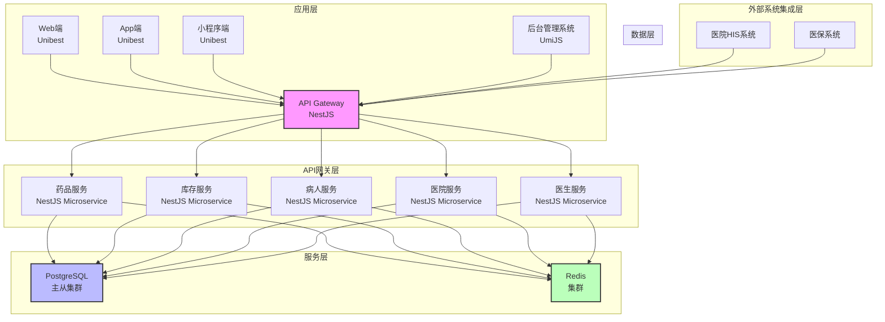
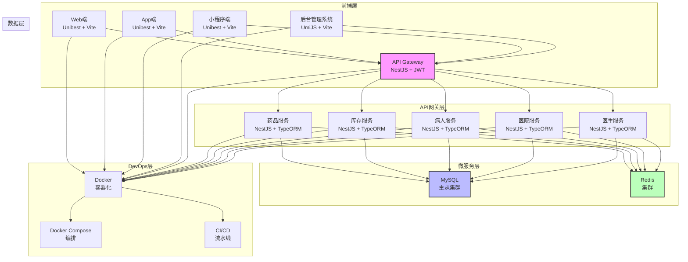
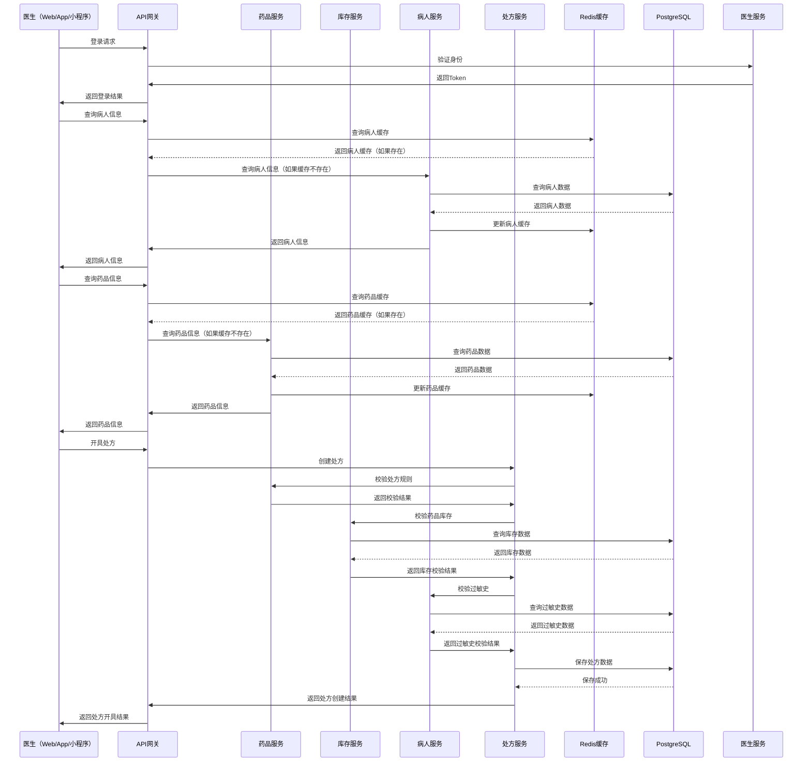
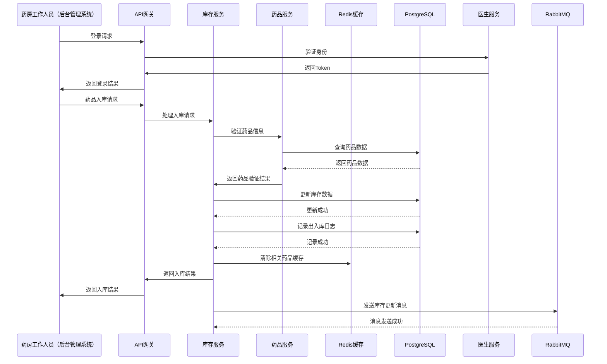
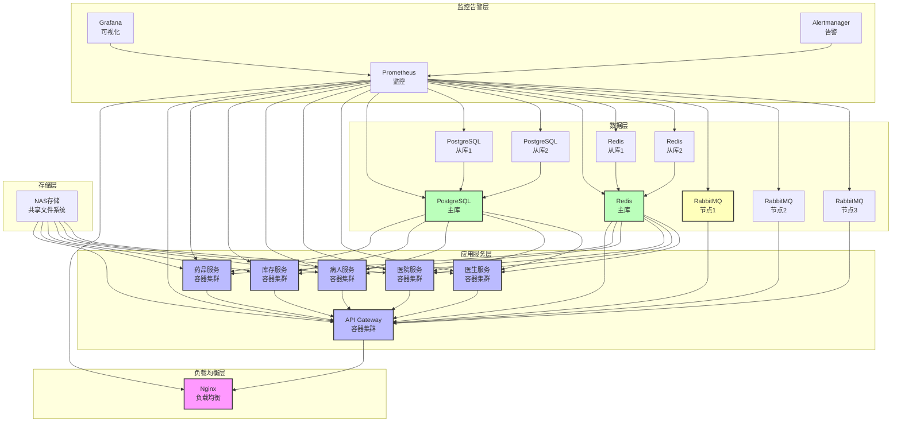

# 医院药品管理系统 - 系统架构设计文档

## 1. 文档概述

### 1.1 文档目的
本架构设计文档详细描述医院药品管理系统的总体架构、功能架构、技术架构、模块划分、核心组件设计等内容，为系统开发提供架构层面的指导，确保系统具备良好的可扩展性、可维护性、高性能和安全性。

### 1.2 设计原则

1. **模块化设计**：系统采用模块化设计，各模块之间低耦合、高内聚，便于独立开发、测试和部署
2. **微服务架构**：基于NestJS实现微服务架构，支持服务的独立扩展和弹性伸缩
3. **前后端分离**：采用前后端分离架构，前端使用不同框架适配不同终端，后端提供统一API
4. **高性能设计**：使用Redis缓存提升系统响应速度，数据库读写分离提高数据处理能力
5. **安全性优先**：采用多层次安全防护，包括身份认证、权限控制、数据加密、操作日志等
6. **可扩展性**：系统设计支持未来功能扩展和性能扩展，可轻松接入新的终端和第三方系统

### 1.3 系统边界

系统边界包括：
- 前端：Web端（Unibest）、App端（Unibest）、小程序端（Unibest）、后台管理系统（UmiJS）
- 后端：基于NestJS的微服务架构
- 数据库：PostgreSQL主从集群
- 缓存：Redis集群
- 外部系统：医院HIS系统、医保系统等

## 2. 系统总体架构

### 2.1 架构概述

医院药品管理系统采用分层架构设计，从下到上依次为：

1. **基础设施层**：包括服务器、网络、存储等硬件设施
2. **数据层**：包括PostgreSQL数据库和Redis缓存
3. **服务层**：基于NestJS的微服务架构，提供核心业务逻辑
4. **API网关层**：统一API入口，负责请求路由、负载均衡、认证授权等
5. **应用层**：包括Web端、App端、小程序端和后台管理系统
6. **外部系统集成层**：负责与医院HIS系统、医保系统等外部系统集成

### 2.2 总体架构图



## 3. 功能架构设计

### 3.1 功能架构图

```mermaid
flowchart TD
    subgraph 系统核心功能
        A[药品管理模块] --> A1[药品信息维护]
        A --> A2[药品分类管理]
        A --> A3[药品处方规则设置]
        B[药品库存管理模块] --> B1[库存查询与管理]
        B --> B2[效期管理]
        B --> B3[库存预警]
        B --> B4[出入库管理]
        C[病人管理模块] --> C1[病人信息维护]
        C --> C2[病人处方历史]
        C --> C3[过敏史管理]
        D[医院管理模块] --> D1[科室管理]
        D --> D2[药房管理]
        D --> D3[基础数据配置]
        E[医生管理模块] --> E1[医生信息维护]
        E --> E2[权限管理]
        E --> E3[处方统计与报表]
        F[处方管理模块] --> F1[处方开具]
        F --> F2[处方审核与流转]
        F --> F3[处方历史管理]
        G[字典管理模块] --> G1[字典类型管理]
        G --> G2[字典项管理]
        G --> G3[字典数据应用]
    end

    subgraph 系统公共功能
        H[身份认证与授权]
        I[操作日志管理]
        J[数据备份与恢复]
        K[系统监控与告警]
        L[API文档管理]
    end

    A --> H
    B --> H
    C --> H
    D --> H
    E --> H
    F --> H
    G --> H
    A --> I
    B --> I
    C --> I
    D --> I
    E --> I
    F --> I
    G --> I
    A --> J
    B --> J
    C --> J
    D --> J
    E --> J
    F --> J
    G --> J
    A --> K
    B --> K
    C --> K
    D --> K
    E --> K
    F --> K
    G --> K
    A --> L
    B --> L
    C --> L
    D --> L
    E --> L
    F --> L
    G --> L

    style G fill:#f9f,stroke:#333,stroke-width:2px
    style H fill:#f9f,stroke:#333,stroke-width:2px
    style I fill:#f9f,stroke:#333,stroke-width:2px
    style J fill:#f9f,stroke:#333,stroke-width:2px
    style K fill:#f9f,stroke:#333,stroke-width:2px
```



### 3.2 模块划分

| 模块名称 | 主要功能 | 服务归属 | 前端归属 |
| ---- | ---- | ---- | ---- |
| 药品管理模块 | 药品信息维护、药品分类管理、药品处方规则设置 | 药品服务 | Web端、App端、小程序端、后台管理系统 |
| 药品库存管理模块 | 库存查询与管理、效期管理、库存预警、出入库管理 | 库存服务 | Web端、App端、小程序端、后台管理系统 |
| 病人管理模块 | 病人信息维护、病人处方历史、过敏史管理 | 病人服务 | Web端、App端、小程序端、后台管理系统 |
| 医院管理模块 | 科室管理、药房管理、基础数据配置 | 医院服务 | 后台管理系统 |
| 医生管理模块 | 医生信息维护、权限管理、处方统计与报表 | 医生服务 | 后台管理系统 |
| 处方管理模块 | 处方开具、处方审核与流转、处方历史管理 | 药品服务 | Web端、App端、小程序端、后台管理系统 |
| 字典管理模块 | 字典类型管理、字典项管理、字典数据应用 | 医院服务 | 后台管理系统 |
| 身份认证与授权 | 用户登录、权限验证、Token管理 | 医生服务 | 所有前端 |
| 操作日志管理 | 记录用户操作行为、日志查询与审计 | 医院服务 | 后台管理系统 |
| 数据备份与恢复 | 自动备份数据、手动恢复数据 | 医院服务 | 后台管理系统 |
| 系统监控与告警 | 系统性能监控、异常告警 | 医院服务 | 后台管理系统 |
| API文档管理 | 自动生成API文档、在线调试 | 所有服务 | 开发者 |

## 4. 技术架构设计

### 4.1 技术栈选型

| 技术层级 | 技术选型 | 版本要求 | 用途 |
| ---- | ---- | ---- | ---- |
| 后端框架 | NestJS + nest-admin | ^10.0.0 | 基于nest-admin的微服务架构实现 |
| 数据库 | MySQL | ^8.0 | 主数据库，存储核心业务数据 |
| 缓存 | Redis | ^6.0 | 缓存热点数据，提升系统响应速度 |
| API网关 | NestJS Gateway | ^10.0.0 | 统一API入口，请求路由、负载均衡 |
| 身份认证 | JWT | ^9.0.0 | 无状态身份认证（nest-admin自带） |
| ORM框架 | TypeORM | ^0.3.0 | 数据库访问层（nest-admin自带） |
| 前端框架（Web/App/小程序） | Unibest | ^3.0.0 | 多端统一开发框架 |
| 前端框架（后台管理） | UmiJS | ^4.0.0 | 后台管理系统开发框架 |
| 构建工具 | Vite | ^4.0.0 | 前端构建工具 |
| 包管理器 | pnpm | ^7.0.0 | 依赖管理工具 |
| 容器化 | Docker | ^20.0.0 | 应用容器化 |
| 容器编排 | Docker Compose | ^2.0.0 | 多容器应用编排 |

### 4.2 技术架构图



### 4.3 核心组件设计

#### 4.3.1 API网关组件

**功能**：
- 统一API入口，负责请求路由
- 负载均衡，分发请求到不同的微服务实例
- 身份认证与授权，验证用户身份和权限
- 请求限流，防止系统过载
- 日志记录，记录API请求和响应
- 异常处理，统一处理系统异常

**技术实现**：
- 基于NestJS实现
- 使用JWT进行身份认证
- 使用Swagger自动生成API文档
- 集成Rate Limiter实现请求限流

#### 4.3.2 微服务组件

**药品服务**：
- 负责药品信息管理、药品分类管理、药品处方规则设置
- 提供药品查询、新增、编辑、删除等API
- 集成药品处方规则引擎，实现处方规则校验

**库存服务**：
- 负责药品库存管理、效期管理、库存预警、出入库管理
- 提供库存查询、调整、盘点等API
- 实现库存阈值预警和效期预警

**病人服务**：
- 负责病人信息管理、病人处方历史、过敏史管理
- 提供病人信息查询、新增、编辑等API
- 实现病人过敏史关联和预警

**医院服务**：
- 负责医院管理、科室管理、药房管理、基础数据配置
- 提供医院、科室、药房信息管理API
- 实现系统参数配置和日志管理

**字典服务**：
- 负责字典类型管理、字典项管理
- 提供字典数据查询、新增、编辑、删除等API
- 实现字典数据缓存和同步

**医生服务**：
- 负责医生信息管理、权限管理、处方统计与报表
- 提供医生信息查询、新增、编辑等API
- 实现基于RBAC的权限管理

#### 4.3.3 数据访问组件

**PostgreSQL主从集群**：
- 主库负责写操作，从库负责读操作
- 实现数据自动同步
- 支持故障自动切换
- 配置定期备份策略

**Redis集群**：
- 用于缓存热点数据，如药品信息、病人信息等
- 实现缓存数据的自动过期和更新
- 支持分布式锁，确保数据一致性
- 配置主从复制和哨兵机制，提高可用性

#### 4.3.4 消息队列组件

**RabbitMQ集群**：
- 用于异步消息处理，如处方审核通知、库存预警等
- 实现服务间的解耦
- 支持消息持久化和重试机制
- 配置集群模式，提高可用性

## 5. 数据流设计

### 5.1 核心业务数据流

#### 5.1.1 处方开具数据流



#### 5.1.2 药品入库数据流



## 6. 接口设计

### 6.1 API设计原则

1. **RESTful API设计**：采用RESTful风格设计API，使用HTTP方法（GET/POST/PUT/DELETE）表示不同操作
2. **统一API版本**：在URL中包含API版本号，如`/api/v1/drugs`
3. **统一响应格式**：所有API返回统一的响应格式，包含状态码、消息和数据
4. **错误处理**：使用HTTP状态码表示错误类型，返回详细的错误信息
5. **分页设计**：对于列表查询接口，支持分页参数（page、pageSize）
6. **排序设计**：支持按字段排序，如`sort=created_at&order=desc`
7. **过滤设计**：支持按字段过滤，如`filter=status:eq:normal`

### 6.2 API响应格式

```json
{
  "code": 200,
  "message": "成功",
  "data": {
    // 响应数据
  },
  "timestamp": 1640995200000,
  "requestId": "uuid-1234567890"
}
```

### 6.3 核心API列表

| API路径 | 方法 | 模块 | 功能描述 | 认证要求 |
| ---- | ---- | ---- | ---- | ---- |
| /api/v1/auth/login | POST | 医生服务 | 用户登录 | 否 |
| /api/v1/auth/logout | POST | 医生服务 | 用户登出 | 是 |
| /api/v1/drugs | GET | 药品服务 | 查询药品列表 | 是 |
| /api/v1/drugs/:id | GET | 药品服务 | 查询药品详情 | 是 |
| /api/v1/drugs | POST | 药品服务 | 新增药品 | 是（管理员/医生） |
| /api/v1/drugs/:id | PUT | 药品服务 | 编辑药品 | 是（管理员/医生） |
| /api/v1/drugs/:id | DELETE | 药品服务 | 删除药品 | 是（管理员） |
| /api/v1/inventory | GET | 库存服务 | 查询库存列表 | 是 |
| /api/v1/inventory/:id | GET | 库存服务 | 查询库存详情 | 是 |
| /api/v1/inventory | POST | 库存服务 | 药品入库 | 是（药房工作人员） |
| /api/v1/inventory/outbound | POST | 库存服务 | 药品出库 | 是（药房工作人员） |
| /api/v1/patients | GET | 病人服务 | 查询病人列表 | 是 |
| /api/v1/patients/:id | GET | 病人服务 | 查询病人详情 | 是 |
| /api/v1/patients | POST | 病人服务 | 新增病人 | 是（医生） |
| /api/v1/prescriptions | GET | 药品服务 | 查询处方列表 | 是 |
| /api/v1/prescriptions/:id | GET | 药品服务 | 查询处方详情 | 是 |
| /api/v1/prescriptions | POST | 药品服务 | 开具处方 | 是（医生） |
| /api/v1/prescriptions/:id/review | PUT | 药品服务 | 处方审核 | 是（药房工作人员） |
| /api/v1/doctors | GET | 医生服务 | 查询医生列表 | 是（管理员） |
| /api/v1/doctors/:id | GET | 医生服务 | 查询医生详情 | 是（管理员/医生） |
| /api/v1/doctors | POST | 医生服务 | 新增医生 | 是（管理员） |

## 7. 部署架构设计

### 7.1 部署架构图



### 7.2 部署策略

1. **容器化部署**：所有服务均采用Docker容器化部署，使用Docker Compose进行本地开发环境的编排
2. **集群部署**：生产环境采用Kubernetes进行集群部署，支持服务的自动扩缩容和故障恢复
3. **多环境隔离**：开发环境、测试环境和生产环境完全隔离，确保系统稳定性
4. **滚动更新**：采用滚动更新策略，确保服务在更新过程中不中断
5. **灰度发布**：支持灰度发布，逐步将新功能推向生产环境

### 7.3 环境配置

| 环境 | 配置 |
| ---- | ---- |
| 开发环境 | 单机部署，使用Docker Compose编排 |
| 测试环境 | 小规模集群部署，模拟生产环境配置 |
| 生产环境 | 大规模集群部署，高可用配置，支持自动扩缩容 |

## 8. 安全架构设计

### 8.1 安全防护体系

1. **身份认证**：
   - 采用用户名+密码+验证码的登录方式
   - 使用JWT进行身份认证，Token有效期可配置
   - 支持单点登录（SSO）集成医院现有认证系统
   - 登录失败次数限制，防止暴力破解

2. **权限控制**：
   - 基于RBAC（角色-权限-用户）模型设计
   - 支持细粒度权限控制，可按模块、功能、数据进行权限分配
   - 权限变更记录可追溯
   - 严格遵循最小权限原则

3. **数据安全**：
   - 敏感数据（如病人身份证号、手机号）加密存储
   - 传输数据采用HTTPS协议
   - 数据库数据定期备份，支持异地备份
   - 缓存数据加密存储

4. **操作安全**：
   - 记录所有用户操作日志，包括登录、操作内容、修改前后数据对比
   - 日志不可篡改，支持日志审计
   - 支持操作回放，便于问题追踪
   - 敏感操作需二次验证

5. **网络安全**：
   - 采用防火墙隔离不同网络区域
   - 配置IP白名单，限制访问来源
   - 定期进行漏洞扫描和安全评估
   - 支持DDoS防护

6. **应用安全**：
   - 输入参数严格校验，防止SQL注入、XSS攻击等
   - 定期更新依赖库，修复已知漏洞
   - 代码定期进行安全审计
   - 配置CSP（内容安全策略）

## 9. 监控与运维设计

### 9.1 系统监控

1. **性能监控**：
   - 监控系统响应时间、吞吐量、并发数等指标
   - 监控数据库查询性能、连接数等指标
   - 监控Redis缓存命中率、内存使用率等指标
   - 监控服务器CPU、内存、磁盘、网络等资源使用率

2. **业务监控**：
   - 监控处方开具数量、药品入库数量等业务指标
   - 监控库存预警、效期预警等业务事件
   - 监控系统错误率、异常数量等指标

3. **日志监控**：
   - 集中收集和分析系统日志
   - 支持日志查询、过滤、统计等功能
   - 配置日志告警规则，及时发现异常

### 9.2 告警设计

1. **告警类型**：
   - 性能告警：系统响应时间超过阈值、CPU使用率过高等
   - 业务告警：库存低于阈值、处方审核通过率异常等
   - 安全告警：登录失败次数过多、异常IP访问等
   - 系统告警：服务宕机、数据库连接失败等

2. **告警方式**：
   - 邮件告警
   - 短信告警
   - 微信告警
   - 系统内告警

3. **告警级别**：
   - 紧急告警：需立即处理的严重问题
   - 重要告警：需尽快处理的重要问题
   - 一般告警：需关注的普通问题
   - 信息告警：用于通知的信息

### 9.3 运维工具

1. **监控工具**：
   - Prometheus：监控数据采集和存储
   - Grafana：监控数据可视化
   - Alertmanager：告警管理

2. **日志工具**：
   - ELK Stack：日志收集、分析和可视化
   - Loki：轻量级日志聚合系统

3. **部署工具**：
   - Docker：容器化
   - Docker Compose：本地开发环境编排
   - Kubernetes：生产环境集群编排

4. **CI/CD工具**：
   - GitLab CI/CD：持续集成和持续部署
   - Jenkins：自动化构建和部署
   - GitHub Actions：代码仓库集成的CI/CD工具

## 10. 扩展性设计

### 10.1 功能扩展性

1. **模块化设计**：系统采用模块化设计，各模块之间低耦合，便于独立扩展
2. **插件化架构**：支持插件化开发，可轻松添加新功能
3. **API优先**：所有功能通过API暴露，便于第三方系统集成
4. **配置驱动**：核心业务规则可通过配置调整，无需修改代码

### 10.2 性能扩展性

1. **水平扩展**：支持服务的水平扩展，可根据负载情况自动增加或减少服务实例
2. **读写分离**：数据库采用读写分离架构，提高数据处理能力
3. **缓存优化**：使用Redis缓存热点数据，减少数据库访问压力
4. **异步处理**：使用消息队列处理异步任务，提高系统吞吐量

### 10.3 数据扩展性

1. **分库分表**：支持数据库分库分表，应对大数据量场景
2. **数据归档**：支持历史数据归档，提高系统查询性能
3. **数据压缩**：对冷数据进行压缩存储，减少存储空间占用

## 11. 结论

本架构设计文档详细描述了医院药品管理系统的总体架构、功能架构、技术架构、模块划分、核心组件设计、数据流设计、接口设计、部署架构设计、安全架构设计、监控与运维设计以及扩展性设计。

该架构设计遵循了模块化、微服务、前后端分离、高性能、安全性优先等设计原则，确保系统具备良好的可扩展性、可维护性、高性能和安全性，能够满足10+医院、100+医生的业务需求，并支持未来功能扩展和性能扩展。

通过该架构设计，系统能够实现：
- 统一的药品管理、库存管理、病人管理、医院管理和医生管理
- 支持多终端访问（Web、App、小程序、后台管理系统）
- 提供高性能、高可用的服务
- 确保数据安全和操作安全
- 支持与医院HIS系统、医保系统等外部系统集成
- 便于未来功能扩展和性能扩展
